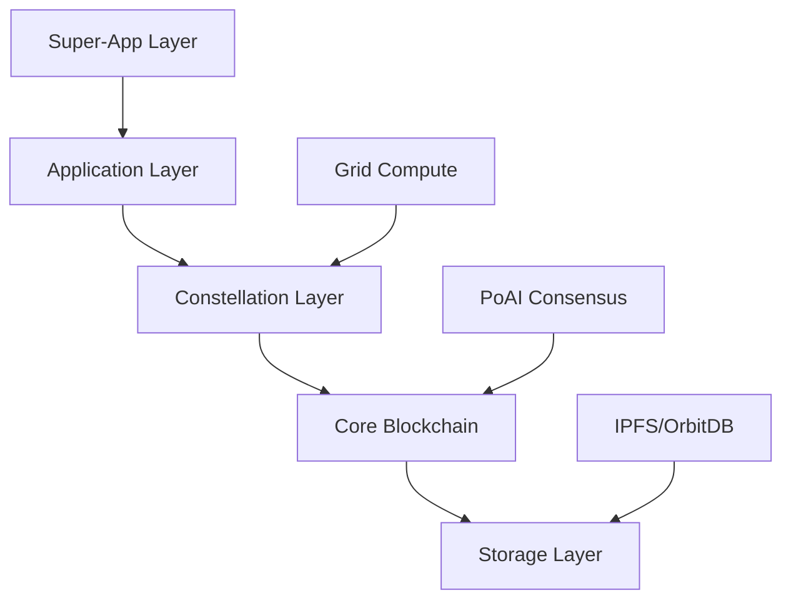

# SELF Chain

<div align="center">
  <h3>The World's First AI-Native Blockchain</h3>
  <p>A revolutionary blockchain ecosystem powered by Proof-of-AI consensus, where your data sovereignty is guaranteed by AI validation</p>
  
  [](https://choosealicense.com/licenses/mit/)
  [](https://discord.gg/WdMdVpA4C8)
  [](https://twitter.com/self_hq)
  [](https://github.com/SELF-Technology/self-chain-public/stargazers)
</div>

## 🌟 Overview

SELF Chain represents a paradigm shift in blockchain technology, combining AI-powered validation with true self-sovereignty. We're building a future where personal data ownership isn't just a promise—it's a fundamental right encoded in our technology.

### Why SELF Chain?

- **🤖 AI-First Design**: Unlike blockchains that add AI as an afterthought, SELF Chain is built from the ground up with AI at its core
- **🔐 True Data Sovereignty**: Your data, your rules—enforced by cryptography and AI
- **⚡ 50,000 TPS Target**: Designed for real-world scale without compromising decentralization
- **🌍 Open Source**: Transparent development with a vibrant community

## 🚀 Key Features

### Revolutionary Consensus
- **Proof-of-AI (PoAI)**: The world's first AI-driven consensus mechanism
- **Color Marker System**: Advanced transaction validation through hexadecimal state tracking
- **AI Validators**: Intelligent block validation replacing energy-intensive mining

### Enterprise Ready
- **Constellation Architecture**: Deploy industry-specific chains for any regulated sector
- **Innovation Platform**: From healthcare to finance, build compliant blockchain solutions
- **Grid Compute**: Distributed AI computation across the network

### Developer First
- **Comprehensive SDKs**: JavaScript, Rust, Python, and Go (coming soon)
- **Testnet Available**: Build and test today with our live testnet
- **Extensive Documentation**: World-class docs to get you started quickly

## 🛠️ Quick Start

### For Developers

```bash
# Clone the repository
git clone https://github.com/SELF-Technology/self-chain-public.git
cd self-chain-public

# Copy testnet configuration
cp config/testnet.example.toml config/testnet.toml

# Build the project
cargo build --release

# Run a testnet node
cargo run --bin self-chain-node -- --testnet
```

> ⚠️ **Testnet Notice**: SELF Chain is currently in testnet. Tokens have no value and the network may reset.

### Get Testnet Tokens

Join our [Discord](https://discord.gg/WdMdVpA4C8) and use the `!faucet` command to receive testnet tokens.

## 📚 Documentation

### Getting Started
- 🎯 [Quick Start Guide (Testnet)](https://docs.self.app/Technical%20Docs/Developer%20Resources/Getting_Started_Testnet)
- 🏗️ [Architecture Overview](https://docs.self.app/Technical%20Docs/SELF%20Chain/SELF_Chain_Architecture)
- 🤖 [Understanding PoAI](https://docs.self.app/Technical%20Docs/PoAI/Proof-of-AI)
- 🎨 [Color Marker System](https://docs.self.app/Technical%20Docs/PoAI/Color%20Marker%20System)

### For Contributors
- 🤝 [Contributing Guide](CONTRIBUTING.md) - Start here!
- 📋 [Code of Conduct](CODE_OF_CONDUCT.md)
- 🏛️ [Governance](GOVERNANCE.md)
- 🔒 [Security Policy](SECURITY.md)

### Developer Resources
- 📖 [API Reference](https://docs.self.app/Technical%20Docs/Developer%20Resources/PUBLIC_INTERFACES)
- 🧩 [SDK Documentation](SDK_STRUCTURE.md)
- 💡 [Example Applications](examples/testnet-demos/)
- 🐛 [Good First Issues](.github/GOOD_FIRST_ISSUES.md)

## 🏗️ Architecture



### Core Components

1. **Blockchain Core**: Transaction processing, block management, state transitions
2. **PoAI Consensus**: AI-driven block validation and consensus
3. **Network Layer**: P2P communication with libp2p
4. **Storage Layer**: Hybrid IPFS/OrbitDB for distributed storage
5. **Cryptography**: Post-quantum ready with Kyber and SPHINCS+

## 🔒 Security

SELF Chain implements defense-in-depth security:

- ✅ **Post-Quantum Cryptography**: Future-proof against quantum attacks
- ✅ **AI-Powered Threat Detection**: Real-time anomaly detection
- ✅ **Multi-Layer Validation**: Defense at every level
- ✅ **Security Audits**: Regular third-party audits
- ✅ **Bug Bounty Program**: Rewards for responsible disclosure

See our [Security Policy](SECURITY.md) for details.

## 🤝 Contributing

We love contributions! SELF Chain embraces the Linux/open-source ethos.

### How to Contribute

1. 🍴 Fork the repository
2. 🌿 Create your feature branch (`git checkout -b feature/amazing-feature`)
3. 💻 Commit your changes (`git commit -m 'feat: add amazing feature'`)
4. 📤 Push to the branch (`git push origin feature/amazing-feature`)
5. 🎉 Open a Pull Request

### Contribution Ideas

- 📚 **Documentation**: Help improve our docs
- 🧪 **Testing**: Add test coverage
- 🔧 **Tools**: Build developer tools
- 🌍 **Translations**: Make SELF global
- 🎨 **Examples**: Create sample applications

See [CONTRIBUTING.md](CONTRIBUTING.md) for detailed guidelines.

## 🗺️ Roadmap

### Q1 2024 - Foundation ✅
- [x] Core blockchain implementation
- [x] PoAI consensus mechanism
- [x] Testnet deployment
- [x] Basic documentation

### Q2 2024 - Developer Experience 🚧
- [ ] JavaScript/TypeScript SDK
- [ ] Public API gateway
- [ ] CLI tool distribution
- [ ] Discord faucet bot
- [ ] Block explorer

### Q3 2024 - Ecosystem Growth
- [ ] Smart contract support
- [ ] Cross-chain bridges
- [ ] Mobile SDK
- [ ] Developer grants program

### Q4 2024 - Mainnet Preparation
- [ ] Security audits
- [ ] Performance optimization
- [ ] Mainnet launch
- [ ] Token generation event

## 📊 Project Status

| Component | Status | Test Coverage |
|-----------|--------|---------------|
| Core Blockchain | ✅ Complete | 75% |
| PoAI Consensus | ✅ Complete | 80% |
| P2P Network | ✅ Complete | 70% |
| Storage Layer | 🚧 In Progress | 60% |
| SDKs | 📅 Planned | - |

## 🌐 Ecosystem

### Official Resources
- 🌍 [Website](https://self.app)
- 📖 [Documentation](https://docs.self.app)
- 💬 [Discord Community](https://discord.gg/WdMdVpA4C8)
- 🐦 [Twitter/X](https://x.com/self_hq)
- 📺 [YouTube](https://www.youtube.com/@selfcommunityvideos)

### Community Projects
- 🔍 [SELF Explorer](https://explorer.self.app) (Coming Soon)
- 🔧 [SELF Tools](https://github.com/topics/self-chain)
- 📱 [Mobile Wallets](https://docs.self.app/wallets)

## 📜 License

This project is licensed under the MIT License - see [LICENSE](LICENSE) for details.

### Open Source Philosophy

We believe in radical transparency with pragmatic security:

**Open Source Components**:
- ✅ Core blockchain protocol
- ✅ Cryptographic implementations  
- ✅ Network protocols
- ✅ SDKs and APIs
- ✅ Documentation

**Security-Critical Components** (Private):
- 🔒 AI validation thresholds
- 🔒 Pattern matching algorithms
- 🔒 Security parameters

This approach, inspired by Signal, ensures both transparency and security.

## 🙏 Acknowledgments

SELF Chain stands on the shoulders of giants:

- The Bitcoin community for proving decentralization works
- The Ethereum community for smart contract innovation
- The Rust community for an amazing systems language
- The open-source community for endless inspiration

## 🎯 Getting Involved

### For Developers
1. ⭐ Star this repository
2. 🍴 Fork and experiment
3. 💬 Join our [Discord](https://discord.gg/WdMdVpA4C8)
4. 🐛 Report bugs or request features
5. 🤝 Submit pull requests

### For Everyone
- 📢 Spread the word about SELF Chain
- ✍️ Write about your experience
- 🎥 Create content and tutorials
- 💡 Share your ideas
- 🌟 Be part of the revolution

## 📞 Contact

- 🐛 **Bug Reports**: [GitHub Issues](https://github.com/SELF-Technology/self-chain-public/issues)
- 💬 **General Discussion**: [Discord](https://discord.gg/WdMdVpA4C8)
- 📧 **Security**: security@self.app
- 🤝 **Partnerships**: partnerships@self.app
- 📰 **Media**: press@self.app

---

<div align="center">
  <h3>🚀 Build the Future with SELF Chain</h3>
  <p><em>"Freedom is a two-edged sword of which one edge is liberty and the other, responsibility."</em> - Jack Parsons</p>
  
  <p>Made with ❤️ by the SELF Community</p>
</div>