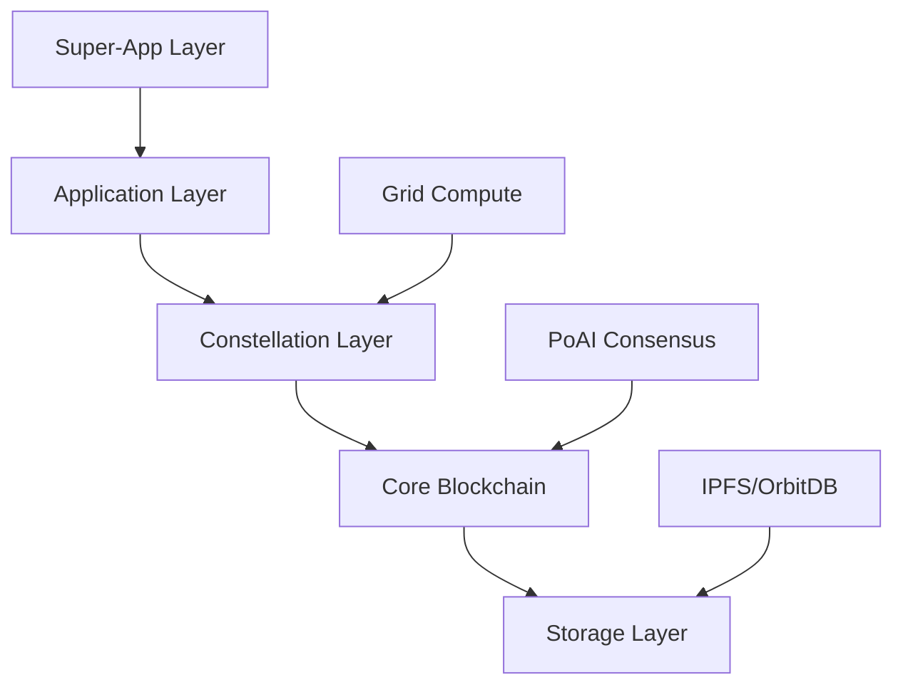

<div align="center">
  <h3>The World's First AI-Native Blockchain - Built by the People, for the People</h3>
  <p>A revolutionary open-source blockchain ecosystem powered by Proof-of-AI consensus, where your data sovereignty is guaranteed by AI validation and community governance</p>
  
  [](https://choosealicense.com/licenses/mit/)
  [](https://discord.gg/WdMdVpA4C8)
  [](https://twitter.com/self_hq)
  [](https://github.com/SELF-Technology/self-chain-public/stargazers)
</div>

## 🌟 Overview: SELF - The Future Of Technology Is Yours

SELF Chain represents a paradigm shift in blockchain technology, combining AI-powered validation with true self-sovereignty. We're building a future where personal data ownership isn't just a promise—it's a fundamental right encoded in our technology.

**This isn't just another blockchain. It's a movement.** As everyone should own and control their own data, we believe that everyone should be able to help construct and verify the chain. SELF Chain is built collaboratively by a global community of developers, researchers, and privacy advocates who believe in digital freedom.

### Why SELF Chain?

- **🤖 AI-First Design**: Unlike blockchains that add AI as an afterthought, SELF Chain is built from the ground up with AI at its core
- **🔐 True Data Sovereignty**: Your data, your rules—enforced by cryptography and AI
- **⚡ 50,000 TPS Target**: Designed for real-world scale without compromising decentralization
- **🌍 Open Source Core**: Transparent blockchain protocol with community-driven development
- **🤝 Community Owned**: No single entity controls SELF—it belongs to everyone

## 🚀 Key Features

### Revolutionary Consensus
- **Proof-of-AI (PoAI)**: The world's first AI-driven consensus mechanism
- **Color Marker System**: Advanced transaction validation through hexadecimal state tracking
- **AI Validators**: Intelligent block validation replacing energy-intensive mining

### Enterprise Ready
- **Constellation Architecture**: Deploy industry-specific chains for any regulated sector
- **Innovation Platform**: From healthcare to finance, build compliant blockchain solutions
- **Grid Compute**: Distributed AI computation across the network

### Developer First
- **Comprehensive SDKs**: JavaScript, Rust, Python, and Go (coming soon)
- **Testnet Available**: Early testnet for testing core functionality
- **Extensive Documentation**: World-class docs to get you started quickly

## 🛠️ Developer Preview

> 🚧 **EARLY ACCESS**: SELF Chain is in active development. Core blockchain functionality is working, but developer tools (SDKs, APIs, faucet) are currently in development. See our [Project Status](/docs/PROJECT_STATUS.md) for current capabilities.

> ⚠️ **TESTNET WARNING**: SELF Chain is currently in testnet phase. Do not use real assets or deploy production applications. Testnet tokens have no value and the network may be reset at any time.

### For Developers

**Note**: The instructions below require blockchain development experience and manual configuration. Easy-access tools are coming soon.

```bash
# Clone the repository
git clone https://github.com/SELF-Technology/self-chain-public.git
cd self-chain-public

# Copy testnet configuration (Template available, testnet not yet deployed)
# cp config/testnet.example.toml config/testnet.toml

# Build the project
cargo build --release

# Run a testnet node (Note: Requires additional setup - see docs)
cargo run --bin self-chain-node -- --testnet
```

> 📄 **Important**: The above commands are provided for reference. Please see our [detailed testnet guide](https://docs.self.app/Technical%20Docs/Developer%20Resources/Getting_Started_Testnet) for complete setup instructions and current limitations.

### Get Testnet Tokens

> ⚠️ **Not Yet Available**: The testnet currently operates without a token economy. Token distribution via faucet is planned for the public testnet launch.

## 📚 Documentation

### Getting Started
- 🎯 [Quick Start Guide (Testnet)](https://docs.self.app/Technical%20Docs/Developer%20Resources/Getting_Started_Testnet)
- 🏗️ [Architecture Overview](https://docs.self.app/Technical%20Docs/SELF%20Chain/SELF_Chain_Architecture)
- 🤖 [Understanding PoAI](https://docs.self.app/Technical%20Docs/PoAI/Proof-of-AI)
- 🎨 [Color Marker System](https://docs.self.app/Technical%20Docs/PoAI/Color%20Marker%20System)

### For Contributors
- 🤝 [Contributing Guide](CONTRIBUTING.md) - Start here!
- 📋 [Code of Conduct](CODE_OF_CONDUCT.md)
- 🏛️ [Governance](GOVERNANCE.md)
- 🔒 [Security Policy](SECURITY.md)

### Developer Resources
- 📖 [API Reference](https://docs.self.app/Technical%20Docs/Developer%20Resources/PUBLIC_INTERFACES)
- 🧩 [SDK Documentation](SDK_STRUCTURE.md)
- 💡 [Example Applications](examples/testnet-demos/)
- 🐛 [Good First Issues](.github/GOOD_FIRST_ISSUES.md)

## 🏗️ Architecture



### Core Components

1. **Blockchain Core**: Transaction processing, block management, state transitions
2. **PoAI Consensus**: AI-driven block validation and consensus
3. **Network Layer**: P2P communication with libp2p
4. **Storage Layer**: Hybrid IPFS/OrbitDB for distributed storage
5. **Cryptography**: Post-quantum ready with Kyber and SPHINCS+

## 🔒 Security

SELF Chain implements defense-in-depth security:

- ✅ **Post-Quantum Cryptography**: Continuously evolving defenses against quantum threats
- ✅ **AI-Powered Threat Detection**: Real-time anomaly detection
- ✅ **Multi-Layer Validation**: Defense at every level
- ✅ **Security Audits**: Regular third-party audits
- ✅ **Bug Bounty Program**: Rewards for responsible disclosure

See our [Security Policy](SECURITY.md) for details.

## 🤝 Contributing: Build the Future Together

SELF Chain is more than code—it's a movement. Every contribution, whether it's fixing a typo or implementing a new feature, helps build the infrastructure for digital freedom. We embrace the Linux/open-source ethos: this technology belongs to everyone.

### Be Part of the Revolution

Whether you're a seasoned blockchain developer or just getting started, there's a place for you in the SELF community. This isn't our chain, it's everyone's chain—and we need your help to make it better.

### How to Contribute

1. 🍴 Fork the repository
2. 🌿 Create your feature branch (`git checkout -b feature/amazing-feature`)
3. 💻 Commit your changes (`git commit -m 'feat: add amazing feature'`)
4. 📤 Push to the branch (`git push origin feature/amazing-feature`)
5. 🎉 Open a Pull Request

### Contribution Ideas

- 📚 **Documentation**: Help improve our docs
- 🧪 **Testing**: Add test coverage
- 🔧 **Tools**: Build developer tools
- 🌍 **Translations**: Make SELF global
- 🎨 **Examples**: Create sample applications

See [CONTRIBUTING.md](CONTRIBUTING.md) for detailed guidelines.

## 🗺️ Roadmap

> 📌 **Note**: This roadmap is subject to change as we continue development. Join our [Discord](https://discord.gg/WdMdVpA4C8) for the latest updates.

### Q1 2025 - Foundation ✅
- [x] Core blockchain implementation
- [x] PoAI consensus mechanism  
- [x] Testnet deployment (early version)
- [x] Basic documentation

### Q2 2025 - Foundation Expansion ✅
- [x] Enhanced blockchain features
- [x] Developer documentation foundation
- [x] Community engagement
- [x] Initial testing framework

### Q3 2025 - Developer Experience 🚧 (Current Phase)
- [ ] JavaScript/TypeScript SDK
- [ ] Public API gateway
- [ ] CLI tool distribution
- [ ] Token faucet system
- [ ] Block explorer

### Q4 2025 - Ecosystem Growth
- [ ] Public testnet launch
- [ ] Enhanced developer tools
- [ ] Community programs
- [ ] Beta testing initiative

## 📊 Project Status

| Component | Status | Test Coverage |
|-----------|--------|---------------|
| Core Blockchain | ✅ Complete | 75% |
| PoAI Consensus | ✅ Complete | 80% |
| P2P Network | ✅ Complete | 70% |
| Storage Layer | 🚧 In Progress | 60% |
| SDKs | 📅 Planned | - |

## 🌐 Ecosystem

### Official Resources
- 🌍 [Website](https://self.app)
- 📖 [Documentation](https://docs.self.app)
- 💬 [Discord Community](https://discord.gg/WdMdVpA4C8)
- 🐦 [Twitter/X](https://x.com/self_hq)
- 📺 [YouTube](https://www.youtube.com/@selfcommunityvideos)

## 📜 License

This project is licensed under the MIT License - see [LICENSE](LICENSE) for details.

### Open Source Philosophy: The People's Chain

We believe in radical transparency with pragmatic security. As everyone should own and control their own data, we believe that everyone should be able to help construct and verify the chain.

**Open Source Components**:
- ✅ Core blockchain protocol
- ✅ Cryptographic implementations  
- ✅ Network protocols
- ✅ SDKs and APIs
- ✅ Documentation

**Security-Critical Components** (Private):
- 🔒 AI validation thresholds
- 🔒 Pattern matching algorithms
- 🔒 Security parameters

**The Future: SELF DAO**  
We're working towards creating SELF DAO to progressively decentralize governance, including oversight of security-critical components. This will ensure community control over the entire project—making SELF truly owned by the people who use and build it.

This approach, inspired by Signal, ensures both transparency and security while building towards complete community ownership.

## 🙏 Acknowledgments

SELF Chain stands on the shoulders of giants:

- The Bitcoin community for proving decentralization works
- The Ethereum community for smart contract innovation
- The Rust community for an amazing systems language
- The open-source community for endless inspiration

## 🎯 Getting Involved

### For Developers
1. ⭐ Star this repository
2. 🍴 Fork and experiment
3. 💬 Join our [Discord](https://discord.gg/WdMdVpA4C8)
4. 🐛 Report bugs or request features
5. 🤝 Submit pull requests

### For Everyone
- 📢 Spread the word about SELF Chain
- ✍️ Write about your experience
- 🎥 Create content and tutorials
- 💡 Share your ideas
- 🌟 Be part of the revolution

## 📞 Contact

- 🐛 **Bug Reports**: [GitHub Issues](https://github.com/SELF-Technology/self-chain-public/issues)
- 💬 **General Discussion**: [GitHub Discussions](https://github.com/SELF-Technology/self-chain-public/discussions)
- 📧 **Security**: security@self.app
- 🤝 **Partnerships**: partners@self.app
- 📰 **Media**: press@self.app

---

<div align="center">
  <h3>🚀 Build the Future with SELF Chain</h3>
  <p><em>"Freedom is a two-edged sword of which one edge is liberty and the other, responsibility."</em> - Jack Parsons</p>
  
  <p>Made with ❤️ by the SELF Community</p>
</div>
