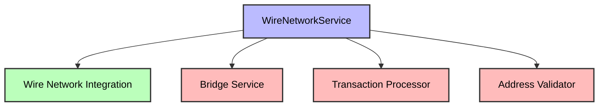
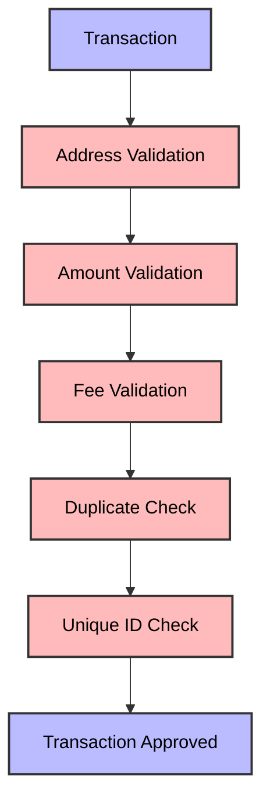
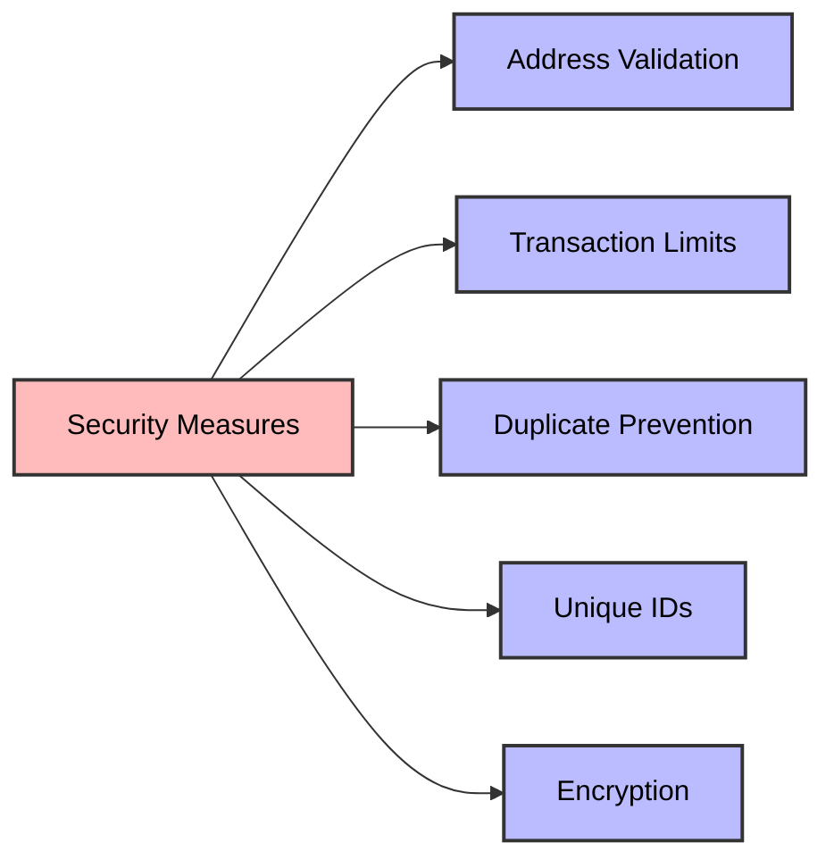

# Wire Network Integration Technical Documentation

## 1. Integration Overview

### 1.1 Purpose and Role
The Wire Network integration in SELF Chain serves as a critical bridge between SELF's native blockchain and external networks, enabling seamless cross-chain communication and asset transfer. This integration is designed to:

- Facilitate cross-chain interoperability with Wire Network
- Enable secure and efficient asset transfers
- Provide real-time network monitoring and performance optimization
- Maintain network security while optimizing transaction throughput

### 1.2 Implementation Architecture
The Wire integration is implemented as a modular bridge service layer that:

1. **Bridge Service Layer**
   - Acts as the intermediary between SELF Chain and Wire Network
   - Manages cross-chain transaction validation and processing
   - Implements security protocols for cross-chain operations

2. **Network Overlay**
   - Creates a dedicated Wire network overlay on top of SELF's existing network
   - Optimizes routing for Wire-specific transactions
   - Implements specialized consensus mechanisms for cross-chain operations

3. **Resource Management**
   - Allocates dedicated resources for Wire operations
   - Implements bandwidth and latency optimization
   - Manages node resources efficiently

### 1.3 Key Features

1. **Cross-Chain Communication**
   - Seamless message passing between SELF and Wire networks
   - Standardized protocol for cross-chain operations
   - Efficient data synchronization mechanisms

2. **Asset Transfer**
   - Secure transfer of SELF tokens to Wire Network
   - Cross-chain atomic swaps
   - Real-time asset tracking and validation

3. **Performance Optimization**
   - Prioritized routing for Wire transactions
   - Bandwidth optimization
   - Latency reduction techniques
   - Resource allocation optimization

4. **Security Features**
   - Multi-layer security validation
   - Cross-chain transaction verification
   - Node authentication and authorization
   - Real-time threat detection

### 1.4 Integration Points

1. **Network Layer**
   - Integration with SELF's P2P network
   - Wire-specific node management
   - Network health monitoring

2. **Transaction Layer**
   - Cross-chain transaction processing
   - Fee calculation and management
   - Transaction validation

3. **Monitoring Layer**
   - Performance tracking
   - Security monitoring
   - Resource utilization monitoring
   - Error detection and reporting

### 1.5 Performance Considerations

1. **Latency Optimization**
   - Implemented specialized routing algorithms
   - Optimized node selection for cross-chain operations
   - Reduced network overhead

2. **Bandwidth Management**
   - Dynamic bandwidth allocation
   - Priority-based resource allocation
   - Traffic shaping for cross-chain operations

3. **Resource Efficiency**
   - Optimized memory usage
   - Efficient CPU utilization
   - Balanced network resource distribution

### 1.6 Security Implementation

1. **Transaction Security**
   - Cross-chain signature verification
   - Double-spending prevention
   - Transaction integrity checks

2. **Network Security**
   - Node authentication
   - Connection validation
   - Security protocol implementation

3. **Data Security**
   - End-to-end encryption
   - Data integrity verification
   - Secure message passing

### 1.7 Monitoring and Maintenance

1. **Performance Monitoring**
   - Real-time transaction tracking
   - Network health monitoring
   - Resource utilization tracking

2. **Maintenance Features**
   - Automated node management
   - Self-healing capabilities
   - Performance optimization

3. **Alert System**
   - Real-time error detection
   - Performance alerts
   - Security warnings

This comprehensive implementation ensures that SELF Chain can seamlessly integrate with Wire Network while maintaining high performance, security, and reliability in all cross-chain operations.

## 2. Core Components

### 2.1 WireNetworkService
- Singleton service managing Wire Network operations
- Manages nodes, connections, and transactions
- Integrates with SELF's bridge service



### 2.2 WireNetworkMetrics
- Performance monitoring system
- Tracks transaction success rates
- Monitors node and connection health
- Calculates network statistics

## 3. Network Architecture

### 3.1 Node Management
```java
// Node Types
- Main Wire Node: "main_wire_node"
- Backup Wire Node: "backup_wire_node"

// Default Configuration
- Bandwidth Limit: SELFParams.WIRE_BANDWIDTH_LIMIT
- Latency Limit: SELFParams.WIRE_LATENCY_LIMIT
- Endpoints:
  * Main: "https://wire.self.network"
  * Backup: "https://backup.wire.self.network"
```

### 3.2 Connection Management

The Wire integration includes a robust connection management system implemented through the WireConnectionManager and WireConnection classes. Key features include:

1. **Connection Features**
```java
// Connection Management
- Active connection tracking
- Connection status monitoring
- Automatic reconnection
- Exponential backoff retry
- Connection timeout handling
```

2. **Connection Flow**
```java
// Connection Initialization
1. Check node status
2. Validate peers
3. Establish connection
4. Monitor connection
5. Handle errors
```

3. **Performance Metrics**
```java
// Connection Statistics
- Active connections count
- Total transactions processed
- Total errors
- Bytes sent/received
- Connection uptime
```

4. **Error Handling**
```java
// Error Recovery
- Network connection errors
- Transaction processing errors
- Connection timeouts
- Automatic retries
- Connection recovery
```

5. **Connection Features**
- Automatic reconnection
- Connection status monitoring
- Performance metrics tracking
- Error rate calculation
- Resource usage tracking

### 3.3 RPC Integration Implementation

The Wire integration uses a custom RPC client to communicate with Wire Network's blockchain. The implementation includes:

1. **RPC Client Features**
```java
// Core RPC Features
- Blockchain information retrieval
- Transaction handling
- Address validation
- Node status monitoring
- Network peer management
- Producer status tracking
- Database size monitoring
```

2. **Transaction Flow**
```java
// Transaction Creation Flow
1. Validate destination address using RPC
2. Create transaction object
3. Push transaction to Wire Network
4. Process through bridge service
5. Update metrics

// Transaction Confirmation Flow
1. Retrieve transaction from pending list
2. Check transaction status via RPC
3. Update confirmation status
4. Update metrics
```

3. **Error Handling**
```java
// Error Handling
- Network connection errors
- Transaction processing errors
- Address validation errors
- RPC response errors
```

### 3.4 Security Implementation

The Wire integration includes a comprehensive security layer implemented through the WireSecurityManager. Key features include:

1. **Key Management**
```java
// Key Generation
- ECDSA key pair generation using secp256k1 curve
- Wire Network compatible public key format (WIRE_PUB_ prefix)
- Wire Network compatible private key format (WIRE_PRIV_ prefix)
```

2. **Transaction Signing**
```java
// Transaction Signing Flow
1. Generate transaction data hash
2. Sign with ECDSA private key
3. Convert to Wire Network compatible signature format (WIRE_SIG_ prefix)
4. Verify signature with public key
```

3. **Address Security**
```java
// Address Generation
- Generate from ECDSA public key
- Wire Network prefix (wire_)
- Fixed length (42 characters)
- Base64 encoding
```

4. **Security Features**
- ECDSA signature verification
- Address format validation
- Transaction data integrity
- Secure key storage
- Error logging### 5. Error Handling

The Wire integration includes comprehensive error handling through the WireErrorHandler. Key features include:

1. **Error Types**
```java
// Error Types
- Connection Errors
- Transaction Errors
- Validation Errors
- RPC Errors
- Security Errors
```

2. **Error Handling Features**
```java
// Error Handling
- Automatic error detection
- Error classification
- Retry mechanism
- Error resolution
- Error logging
```

3. **Error Recovery**
```java
// Recovery Mechanisms
- Connection reestablishment
- Transaction resubmission
- Validation retry
- RPC retry
- Security recovery
```

4. **Error Statistics**
```java
// Error Metrics
- Active errors count
- Total errors
- Resolved errors
- Retry attempts
- Resolution rate
```

5. **Error Flow**
```java
// Error Handling Flow
1. Detect error
2. Classify error type
3. Attempt resolution
4. Log error details
5. Update metrics
```

### 5.1 Security Flow
```java
// Transaction Security Flow
1. Generate transaction data
2. Sign with private key
3. Verify with public key
4. Validate address format
5. Check RPC response signatures
```

## 4. Transaction Flow

### 4.1 Transaction Creation
```java
public boolean createWireTransaction(MiniData zTxID, MiniNumber zAmount, String zDestination) {
    // 1. Validate Wire address format
    // 2. Create WireTransaction object
    // 3. Add to pending transactions
    // 4. Process through BridgeService
    // 5. Update metrics
}
```

### 4.2 Transaction Confirmation
```java
public boolean confirmWireTransaction(MiniData zTxID) {
    // 1. Retrieve transaction from pending list
    // 2. Mark as confirmed
    // 3. Update metrics
    // 4. Return confirmation status
}
```

### 4.3 Transaction Monitoring

The Wire integration includes comprehensive transaction monitoring through the WireTransactionMonitor. Key features include:

1. **Transaction Tracking**
```java
// Transaction Monitoring
- Active transaction tracking
- Confirmation monitoring
- Error detection
- Latency measurement
- Resource usage tracking
```

2. **Monitoring Features**
```java
// Monitoring Configuration
- 5 second check interval
- 3 retry attempts
- 12 block confirmation threshold
- Automatic error recovery
```

3. **Transaction Status**
```java
// Status Tracking
- Active transactions
- Confirmed transactions
- Failed transactions
- Transaction latency
- Resource usage
```

4. **Performance Metrics**
```java
// Transaction Statistics
- Active transactions count
- Total transactions processed
- Total confirmed transactions
- Total failed transactions
- Average transaction latency
- Resource usage metrics
```

5. **Error Handling**
```java
// Error Recovery
- Network connection errors
- Transaction processing errors
- Confirmation failures
- Automatic retries
- Error logging
```

## 5. Security Considerations

### 5.1 Security Flow



### 5.2 Security Measures



## 6. Performance Monitoring

### 6.1 Metrics Collection
```java
// Transaction Metrics
- Total transactions
```

- Successful transactions
- Total amount processed
- Average transaction amount
- Success rate calculation

// Network Metrics
- Node uptime
- Connection stability
- Latency tracking
- Bandwidth utilization
```

### 6.2 Status Updates
```java
public void updateNodeStatus(String zNodeID, boolean zIsOnline) {
    // Update node online status
    // Track uptime statistics
    // Update metrics
}

public void updateConnectionStatus(String zConnectionID, boolean zIsActive) {
    // Update connection status
    // Track active time
    // Update metrics
}
```

## 7. Integration Points

### 7.1 Bridge Service Integration
- Uses BridgeService for cross-chain operations
- Implements bridge parameters for Wire Network
- Handles fee calculations
- Manages transaction limits

### 7.2 Monitoring Integration
- Integrates with GovernanceMonitor
- Provides detailed network statistics
- Tracks performance metrics
- Reports errors and issues

## 8. Error Handling

### 8.1 Transaction Errors
- Invalid address format
- Insufficient funds
- Network connectivity issues
- Duplicate transactions
- Transaction timeout

### 8.2 Network Errors
- Node offline detection
- Connection failures
- Latency issues
- Bandwidth limitations

## 9. Future Considerations

### 9.1 Potential Enhancements
- Additional node types
- Enhanced security features
- Advanced monitoring capabilities
- Performance optimizations
- Additional validation layers

### 9.2 Integration Points for Future Development
- Additional bridge types
- Network optimization features
- Security enhancements
- Performance improvements

## 10. Testing Requirements

### 10.1 Unit Tests
- Node management
- Connection handling
- Transaction processing
- Error handling
- Performance metrics

### 10.2 Integration Tests
- Cross-chain transactions
- Network stability
- Error scenarios
- Performance testing
- Security testing

## 11. Documentation Requirements

### 11.1 API Documentation
- Node management endpoints
- Transaction endpoints
- Monitoring endpoints
- Error codes and messages

### 11.2 Configuration Documentation
- Node configuration
- Connection settings
- Transaction parameters
- Security settings

### 11.3 Monitoring Documentation
- Metrics collection
- Alert thresholds
- Performance indicators
- Error reporting
