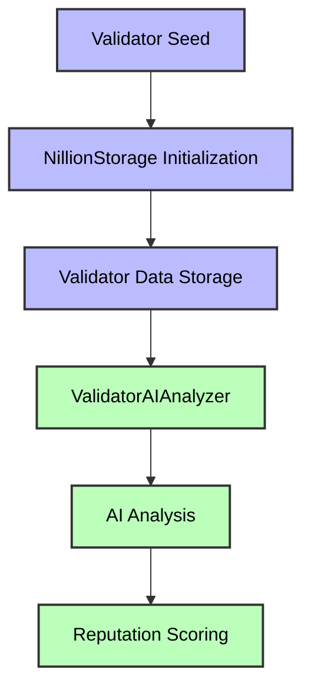
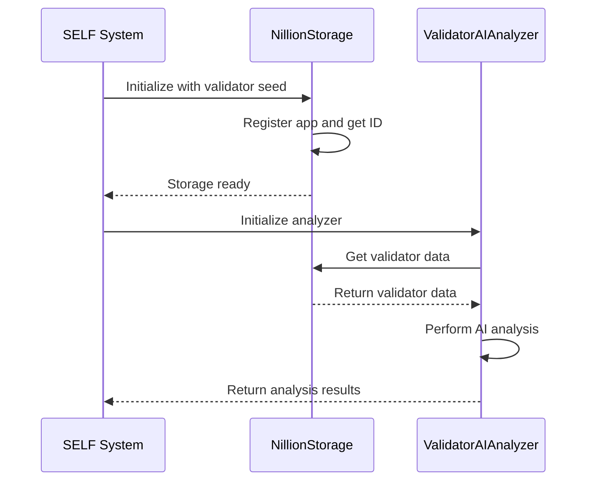
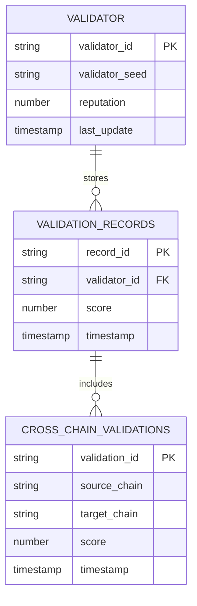
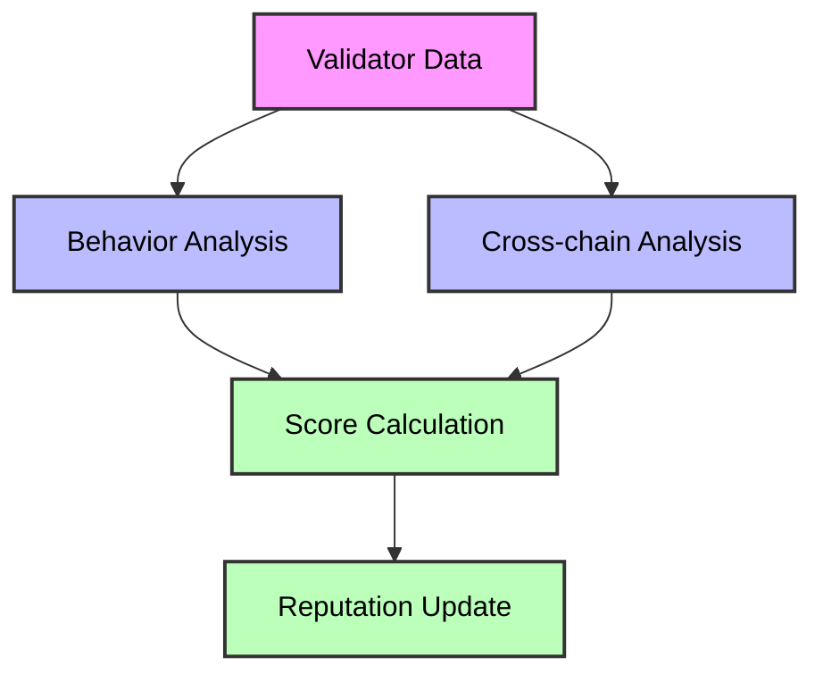

# SELF Node Initialization with PoAI Integration

This document outlines the initialization process for a SELF node with PoAI (Proof of AI) capabilities, leveraging Nillion's decentralized storage and AI services.

## Initialization Flow

The initialization process occurs in the `SELF.main()` method and follows these steps:

### 1. System Parameter Setup
```java
// Set the Parameters
ParamConfigurer.setParameters();
```

### 2. Validator Initialization
```java
// Initialize validator with PoAI
try {
    // Get validator seed from system parameters
    SELFData validatorSeed = SELFParams.CURRENT_VALIDATOR_SEED;
    
    // Initialize Nillion storage
    NillionStorage storage = new NillionStorage(validatorSeed);
    
    // Initialize validator analyzer
    ValidatorAIAnalyzer analyzer = new ValidatorAIAnalyzer(storage);
    
    // Store the analyzer in the system
    SELFSystem.getInstance().setValidatorAnalyzer(analyzer);
    
    // Initialize validator reputation
    SELFData validatorId = storage.getValidatorID();
    SELFNumber reputation = analyzer.getAIReputationScore(validatorId);
    
    // Log initialization
    SelfLogger.log("Validator initialized with AI reputation: " + reputation.toString());
} catch (Exception e) {
    SelfLogger.log("Error initializing validator with PoAI: " + e.getMessage());
}
```

## Key Components

### NillionStorage
- Handles all interactions with Nillion's decentralized storage
- Manages validator data and chain states
- Provides secure storage for validation records
- Implements SecretLLM integration for AI analysis

### ValidatorAIAnalyzer
- Analyzes validator behavior patterns
- Calculates AI-based reputation scores
- Performs risk assessment
- Provides cross-chain validation analysis

## Data Flow



### Initialization Flow



### Data Storage Structure



### AI Analysis Flow



## Key Components

### NillionStorage
- Handles all interactions with Nillion's decentralized storage
- Manages validator data and chain states
- Provides secure storage for validation records
- Implements SecretLLM integration for AI analysis

## Error Handling

The initialization process includes comprehensive error handling:
- Logs initialization errors
- Graceful failure for AI components
- Maintains core functionality if AI components fail

## Security Considerations

1. **Data Privacy**
   - All data processed in TEE
   - No plaintext data exposure
   - Secure storage with permissions

2. **AI Processing**
   - Uses Nillion's SecretLLM
   - Secure model execution
   - Privacy-preserving analysis

## Future Enhancements

1. **Periodic Updates**
   - Scheduled validator analysis
   - Continuous reputation monitoring
   - Automated risk assessment

2. **Enhanced Analysis**
   - More sophisticated scoring algorithms
   - Additional risk factors
   - Transaction pattern analysis

3. **Integration Points**
   - Cross-chain validation
   - Network behavior analysis
   - Transaction processing

## References

- [Nillion Storage Documentation](https://docs.nillion.com/build/secret-vault)
- [SecretLLM Documentation](https://docs.nillion.com/build/secretLLM)
- [SELF System Architecture](../architecture.md)
