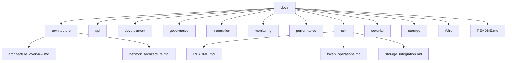

# SELF Documentation

## Overview

This documentation provides comprehensive technical documentation for the SELF blockchain project, covering all aspects from core architecture to implementation details. The documentation is organized into several key sections to facilitate easy navigation and understanding.

## Core Documentation Structure

### 1. Architecture Documentation
- [/architecture/](cci:7://file:///Users/jmac/Documents/GitHub/self-chain-public/docs/architecture:0:0-0:0)
  - `SELF_chain_architecture.md`: Comprehensive system architecture
- [/Diagrams/](cci:7://file:///Users/jmac/Documents/GitHub/self-chain-public/docs/Diagrams:0:0-0:0)
  - `SELF_Chain_Architecture`: Comprehensive system architecture diagram

### 2. API Documentation
- [/api/](cci:7://file:///Users/jmac/Documents/GitHub/self-chain-public/docs/api:0:0-0:0)
  - `API_DOCUMENTATION.md`: Comprehensive API reference
  - `tps_optimization.md`: Performance optimization details
  - `advanced_tps_optimization.md`: Advanced optimization techniques

### 3. Development
- [/development/](cci:7://file:///Users/jmac/Documents/GitHub/self-chain-public/docs/development:0:0-0:0)
  - `CODE_STYLE_GUIDE.md`: Code style and conventions
  - `TESTING_REQUIREMENTS.md`: Testing framework and requirements

### 4. Governance
- [/governance/](cci:7://file:///Users/jmac/Documents/GitHub/self-chain-public/docs/governance:0:0-0:0)
  - `AI_TRAINING_SYSTEM.md`: AI governance documentation
  - `GOVERNANCE_IMPLEMENTATION.md`: Governance implementation details

### 5. Integration
- [/integration/](cci:7://file:///Users/jmac/Documents/GitHub/self-chain-public/docs/integration:0:0-0:0)
  - `COINBASE_INTEGRATION.md`: Coinbase integration details
  - `ROSETTA_ERC20_INTEGRATION.md`: Rosetta ERC20 integration

### 6. Monitoring
- [/monitoring/](cci:7://file:///Users/jmac/Documents/GitHub/self-chain-public/docs/monitoring:0:0-0:0)
  - `monitoring_and_alerting.md`: Monitoring system documentation

### 7. Performance
- [/performance/](cci:7://file:///Users/jmac/Documents/GitHub/self-chain-public/docs/performance:0:0-0:0)
  - `tps_optimization.md`: Transaction processing optimization
  - `advanced_tps_optimization.md`: Advanced optimization techniques

### 8. SDK
- [/sdk/](cci:7://file:///Users/jmac/Documents/GitHub/self-chain-public/docs/sdk:0:0-0:0)
  - `README.md`: SDK overview and features
  - `token_operations.md`: Token operations documentation
  - `storage_integration.md`: Storage integration documentation

### 9. Security
- [/security/](cci:7://file:///Users/jmac/Documents/GitHub/self-chain-public/docs/security:0:0-0:0)
  - `AI_CAPACITY_IMPLEMENTATION.md`: AI capacity implementation
  - `SECURITY.md`: Core security documentation

### 10. Storage
- [/storage/](cci:7://file:///Users/jmac/Documents/GitHub/self-chain-public/docs/storage:0:0-0:0)
  - `HYBRID_ARCHITECTURE.md`: Hybrid storage architecture (IPFS + OrbitDB)

### 11. Wire Network
- [/Wire/](cci:7://file:///Users/jmac/Documents/GitHub/self-chain-public/docs/Wire:0:0-0:0)
  - `WIRE_NETWORK_INTEGRATION.md`: Wire Network integration details

## Key Technical Components

### 1. Core Architecture
- Proof-of-AI (PoAI) consensus mechanism
- Hybrid storage architecture (IPFS + OrbitDB)
- Cross-chain capabilities
- AI integration with Ollama Cloud

### 2. Storage Layer
- Decentralized storage using IPFS
- Real-time database with OrbitDB
- Cross-chain data synchronization

### 3. AI Integration
- Ollama Cloud integration
- Context-aware AI assistants
- AI-powered validation
- Validator reputation system

### 4. Security Features
- Decentralized key management
- Transaction signing and verification
- Network security
- AI-powered security validation

## Documentation Tools

This documentation uses several tools and technologies:

1. **Mermaid Diagrams**
   - Interactive diagram generation
   - GitHub rendering support
   - Architecture visualization

2. **Markdown**
   - Structured documentation
   - Easy maintenance
   - GitHub compatibility

3. **Version Control**
   - Git integration
   - Documentation history
   - Branch management

## Getting Started

### Prerequisites
- GitHub account
- Mermaid diagram viewer enabled
- Basic understanding of blockchain concepts

### Navigation Tips
1. Start with the architecture overview
2. Explore specific components in their respective folders
3. Use the SDK documentation for development
4. Reference the API documentation for integration

## Contributing

1. Clone the repository
2. Make documentation changes
3. Test rendering in GitHub
4. Submit pull request

## Documentation Standards

1. **Consistency**
   - Standard markdown format
   - Clear section headers
   - Consistent terminology

2. **Accuracy**
   - Regular updates
   - Technical verification
   - Code examples

3. **Clarity**
   - Simple explanations
   - Step-by-step guides
   - Visual aids

## Directory Structure

## SELF Chain Architecture

This diagram shows the complete architecture of the SELF Chain system, including all layers and their relationships.

This diagram shows the complete documentation structure, with each component linked to its respective subcomponents. The documentation is designed to be both comprehensive and modular, allowing developers to dive deep into specific areas while maintaining an overview of the entire system.

## Additional Resources

- PoAI Documentation: https://proofofai.com
- Ollama Cloud Documentation: https://ollama.ai/docs
- IPFS Integration Guide: https://docs.ipfs.tech/
- OrbitDB Documentation: https://orbitdb.org/docs/

## Contact

For questions or contributions, please email [j@self.app](mailto:j@self.app).

## Documentation References

- Ollama Cloud: https://ollama.ai/docs
- IPFS: https://docs.ipfs.tech/
- OrbitDB: https://orbitdb.org/docs/
