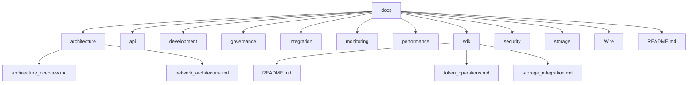

# 🚀 SELF Chain Documentation

**The world's first AI-native blockchain platform - comprehensive documentation for developers, enterprises, and innovators.**

 

---

## ⚡ **Get Started in Minutes**

| 🚀 **Quick Start** | 🕰️ **Time** | 🎯 **For** |
|----------------------|------------|----------|
| [Personal AI Setup](Grid%20Compute/Overview.md#getting-started) | 5 minutes | Individual Users |
| [Enterprise Demo](constellation/Overview.md#innovation-sandbox) | 15 minutes | Business Leaders |
| [Developer SDK](SDK/README.md#quick-start) | 10 minutes | Technical Teams |
| [API Integration](API/API_documentation.md#getting-started) | 20 minutes | Development Teams |

---

## 🎯 Choose Your Path

<table>
<tr>
<td width="33%">

### 👨‍💻 **For Developers**
**Build the next generation of AI-native applications**

🚀 **Quick Start**
- [5-minute Setup Guide](SDK/README.md#quick-start)
- [API Reference](API/API_documentation.md)
- [Code Examples](Development/Code_Style_Guide.md)

🔧 **Development Tools**
- [SDK Libraries](SDK/README.md) - Multi-language support
- [SELFScript](SELFScript/SELFScript_Spec.md) - Smart contract language
- [Testing Framework](Development/Testing_Requirements.md)

📊 **Performance**
- [TPS Optimization](Performance/TPS_Optimization.md)
- [Consensus Resilience](../tests/consensus_resilience/)
- [Security Analysis](Security/Pattern_Analysis_Security.md)

</td>
<td width="33%">

### 🏢 **For Enterprises**
**Transform your industry with compliant blockchain innovation**

💡 **Innovation Platform**
- [Constellation Overview](constellation/Overview.md)
- [Industry Validation](constellation/Industry_Validation_Rules.md)
- [Regulatory Compliance](constellation/Regulatory_Compliance.md)

🎯 **Industry Solutions**
- Finance, Healthcare, Supply Chain
- Government, Energy + Unlimited Expansion
- [50+ Validation Frameworks](constellation/Industry_Validation_Rules.md)

💼 **Enterprise Features**
- [Architecture](Architecture/Constellation_Architecture.md)
- [Security & Compliance](Security/Overview.md)
- [Deployment Guide](constellation/Overview.md#getting-started)

</td>
<td width="33%">

### 🌟 **For Individuals**
**Experience true digital sovereignty with personal AI**

🤖 **Personal AI Cloud**
- [Grid Compute Overview](Grid%20Compute/Overview.md)
- [User Journey](Grid%20Compute/User_Journey.md)
- [Pricing & Plans](Grid%20Compute/Overview.md#transparent-pricing)

🛡️ **Digital Sovereignty**
- Your AI, Your Blockchain, Your Data
- [Competitive Advantages](Grid%20Compute/Competitive_Advantages.md)
- [Business Model](Grid%20Compute/Business_Model.md)

🎮 **Get Started**
- [Free Innovation Sandbox](Grid%20Compute/Overview.md#getting-started)
- Easy Cloud ($4/month)
- [Contact for Access](mailto:devs@self.app)

</td>
</tr>
</table>

---

## 🏗️ **Platform Architecture**

### **🤖 Grid Compute** - Decentralized AI Computing
**Transform how you interact with AI and blockchain technology**
- 🏠 Personal AI cloud on your chosen infrastructure  
- 💫 Shine % progression system with natural upgrades
- 🌐 Global Grid Network launching 2026
- 📖 **[Explore Grid Compute →](Grid%20Compute/Overview.md)**

### **🏢 Constellation** - Enterprise Innovation Platform  
**Blockchain innovation for regulated industries**
- 🎯 1000+ validation frameworks across 50+ sectors by 2027
- 💰 Innovation Sandbox (Free) → Commercial Tiers ($50K-$750K+)
- 🔒 Automated compliance with 25+ regulatory frameworks
- 📖 **[Explore Constellation →](constellation/Overview.md)**

### **⚡ PoAI Consensus** - AI-Powered Blockchain
**First blockchain with native AI consensus mechanism**
- 🧠 99.2% consensus accuracy with AI validation
- 🚀 1000+ TPS capability with sub-second finality
- 🔐 Post-quantum cryptography ready
- 📖 **[Explore PoAI →](PoAI/Taxonomy.md)**

---

## 📚 **Complete Documentation Index**

### **🚀 Quick Start Guides**
<table>
<tr>
<td width="50%">

**For Developers**
- [5-Minute Setup](SDK/README.md#quick-start)
- [First dApp Tutorial](Development/Code_Style_Guide.md)
- [API Quickstart](API/API_documentation.md#getting-started)

</td>
<td width="50%">

**For Enterprises**
- [Innovation Sandbox Access](constellation/Overview.md#innovation-sandbox)
- [Industry Assessment](constellation/Industry_Validation_Rules.md)
- [Enterprise Onboarding](constellation/Overview.md#getting-started)

</td>
</tr>
</table>

### **🏗️ Technical Documentation**

### 1. Architecture Documentation
- [Architecture/](https://github.com/SELF-Technology/self-chain-public/tree/main/docs/Architecture)
  - [SELF_Chain_Architecture.md](https://github.com/SELF-Technology/self-chain-public/blob/main/docs/Architecture/SELF_Chain_Architecture.md): Comprehensive system architecture
  - [Constellation_Architecture.md](https://github.com/SELF-Technology/self-chain-public/blob/main/docs/Architecture/Constellation_Architecture.md): Enterprise blockchain solutions with 7.5%/20% token revenue model
  - [B2B_Constellation_Architecture.md](https://github.com/SELF-Technology/self-chain-public/blob/main/docs/Architecture/B2B_Constellation_Architecture.md): Business-focused enterprise overview

### 2. Consensus
- [PoAI/](https://github.com/SELF-Technology/self-chain-public/tree/main/docs/PoAI)
  - [Taxonomy.md](https://github.com/SELF-Technology/self-chain-public/blob/main/docs/PoAI/Taxonomy.md): PoAI taxonomy and classification

### 3. API Documentation
- [API/](https://github.com/SELF-Technology/self-chain-public/tree/main/docs/API)
  - [API_documentation.md](https://github.com/SELF-Technology/self-chain-public/blob/main/docs/API/API_documentation.md): Comprehensive API reference

### 4. Development
- [Development/](https://github.com/SELF-Technology/self-chain-public/tree/main/docs/Development)
  - [Code_Style_Guide.md](https://github.com/SELF-Technology/self-chain-public/blob/main/docs/Development/Code_Style_Guide.md): Code style and conventions
  - [Testing_Requirements.md](https://github.com/SELF-Technology/self-chain-public/blob/main/docs/Development/Testing_Requirements.md): Testing framework and requirements
  - [SELFScript/SELFScript_Spec.md](https://github.com/SELF-Technology/self-chain-public/blob/main/docs/SELFScript/SELFScript_Spec.md): SELFScript Specification
  - [SELFScript/SELFScript_Developer_Guide.md](https://github.com/SELF-Technology/self-chain-public/blob/main/docs/SELFScript/SELFScript_Developer_Guide.md): SELFScript Developer Guide

### 5. Governance
- [Governance/](https://github.com/SELF-Technology/self-chain-public/tree/main/docs/Governance)
  - [AI_training_system.md](https://github.com/SELF-Technology/self-chain-public/blob/main/docs/Governance/AI_training_system.md): AI governance documentation
  - [Governance_Implementation.md](https://github.com/SELF-Technology/self-chain-public/blob/main/docs/Governance/Governance_Implementation.md): Governance Implementation Details

### 6. Integration
- [Integration/](https://github.com/SELF-Technology/self-chain-public/tree/main/docs/Integration)
  - [Coinbase_Integration.md](https://github.com/SELF-Technology/self-chain-public/blob/main/docs/Integration/Coinbase_Integration.md): Coinbase Integration Details
  - [Rosetta_ERC20_Integration.md](https://github.com/SELF-Technology/self-chain-public/blob/main/docs/Integration/Rosetta_ERC20_Integration.md): Rosetta ERC20 Integration
  - [Minima/Backward_Compatibility.md](https://github.com/SELF-Technology/self-chain-public/blob/main/docs/Integration/Minima/Backward_Compatibility.md): Minima backward Compatibility
  - [Wire/Wire_Network_Integration.md](https://github.com/SELF-Technology/self-chain-public/blob/main/docs/Integration/Wire/Wire_Network_Integration.md): Wire Network Integration

### 7. Monitoring
- [Monitoring/](https://github.com/SELF-Technology/self-chain-public/tree/main/docs/Monitoring)
  - [Monitoring_and_Alerting.md](https://github.com/SELF-Technology/self-chain-public/blob/main/docs/Monitoring/Monitoring_and_Alerting.md): Monitoring System Documentation

### 8. Performance
- [Performance/](https://github.com/SELF-Technology/self-chain-public/tree/main/docs/Performance)
  - [TPS_Optimization.md](https://github.com/SELF-Technology/self-chain-public/blob/main/docs/Performance/TPS_Optimization.md): Transaction Processing Optimization
  - [Advanced_TPS_Optimization.md](https://github.com/SELF-Technology/self-chain-public/blob/main/docs/Performance/Advanced_TPS_Optimization.md): Advanced Optimization Techniques

### 9. SDK
- [SDK/](https://github.com/SELF-Technology/self-chain-public/tree/main/docs/SDK)
  - [README.md](https://github.com/SELF-Technology/self-chain-public/blob/main/docs/SDK/README.md): SDK overview and features
  - [Token_Operations.md](https://github.com/SELF-Technology/self-chain-public/blob/main/docs/SDK/Token_Operations.md): Token Operations Documentation
  - [Storage_Integration.md](https://github.com/SELF-Technology/self-chain-public/blob/main/docs/SDK/Storage_Integration.md): Storage Integration Documentation

### 10. Security
- [Security/](https://github.com/SELF-Technology/self-chain-public/tree/main/docs/Security)
  - [Overview.md](https://github.com/SELF-Technology/self-chain-public/blob/main/docs/Security/Overview.md): Security Overview Documentation
  - [Pattern_Analysis_Security.md](https://github.com/SELF-Technology/self-chain-public/blob/main/docs/Security/Pattern_Analysis_Security.md): Transaction Pattern Analysis Security System
  - [Post_Quantum_Cryptography.md](https://github.com/SELF-Technology/self-chain-public/blob/main/docs/Security/Post_Quantum_Cryptography.md): Post-Quantum Cryptography Implementation
  - [AI_Capacity_Implementation.md](https://github.com/SELF-Technology/self-chain-public/blob/main/docs/Security/AI_Capacity_Implementation.md): AI Capacity Implementation

### 11. Grid Compute
- [Grid Compute/](https://github.com/SELF-Technology/self-chain-public/tree/main/docs/Grid%20Compute)
  - [Overview.md](https://github.com/SELF-Technology/self-chain-public/blob/main/docs/Grid%20Compute/Overview.md): Decentralized AI-native computing platform
  - [User_Journey.md](https://github.com/SELF-Technology/self-chain-public/blob/main/docs/Grid%20Compute/User_Journey.md): Complete user experience from signup to sovereignty
  - [Competitive_Advantages.md](https://github.com/SELF-Technology/self-chain-public/blob/main/docs/Grid%20Compute/Competitive_Advantages.md): Market advantages and differentiators
  - [Business_Model.md](https://github.com/SELF-Technology/self-chain-public/blob/main/docs/Grid%20Compute/Business_Model.md): Platform economics and revenue model

### 12. Constellation Architecture
- [constellation/](https://github.com/SELF-Technology/self-chain-public/tree/main/docs/constellation)
  - [Overview.md](https://github.com/SELF-Technology/self-chain-public/blob/main/docs/constellation/Overview.md): Enterprise blockchain innovation platform
  - [Industry_Validation_Rules.md](https://github.com/SELF-Technology/self-chain-public/blob/main/docs/constellation/Industry_Validation_Rules.md): Comprehensive industry-specific compliance
  - [Regulatory_Compliance.md](https://github.com/SELF-Technology/self-chain-public/blob/main/docs/constellation/Regulatory_Compliance.md): 25+ automated regulatory frameworks

### 13. Storage
- [Storage/](https://github.com/SELF-Technology/self-chain-public/tree/main/docs/Storage)
  - [Hybrid_Architecture.md](https://github.com/SELF-Technology/self-chain-public/blob/main/docs/Storage/Hybrid_Architecture.md): Hybrid Storage Architecture (IPFS + OrbitDB)

### 14. SELF Validate
- [Validate/](https://github.com/SELF-Technology/self-chain-public/tree/main/docs/Validate)
  - [README.md](https://github.com/SELF-Technology/self-chain-public/blob/main/docs/Validate/README.md): Data integrity and verification system

## Key Technical Components

### 1. Core Architecture
- Proof-of-AI (PoAI) consensus mechanism
- Hybrid storage architecture (IPFS + OrbitDB)
- Cross-chain capabilities
- AI integration with Ollama Cloud
- Advanced sharding implementation
- Compute distribution system
- Resource optimization
- Load balancing

### 2. Storage Layer
- Decentralized storage using IPFS
- Real-time database with OrbitDB
- Cross-chain data synchronization
- Advanced sharding
- Storage optimization
- Data consistency

### 3. AI Integration
- Ollama Cloud integration
- Context management
- AI-powered validation
- Assistant functionality
- Validator reputation system
- AI-powered security validation

### 4. Security Features
- Decentralized key management
- Transaction signing and verification
- Network security
- AI-powered security validation
- Validator reputation system
- Context-aware security

### 5. SDK Layer
- Multi-language support (Rust, Java, JavaScript, Solidity)
- Token operations
- Storage integration
- AI capabilities
- Cross-chain functionality
- Key management
- Authentication
- Local development tools
- Testing utilities
- Integration examples

### 6. Grid Compute Platform
- [Grid Compute/](https://github.com/SELF-Technology/self-chain-public/tree/main/docs/Grid%20Compute)
  - [Overview.md](https://github.com/SELF-Technology/self-chain-public/blob/main/docs/Grid%20Compute/Overview.md): Complete platform overview and user experience
  - [User_Journey.md](https://github.com/SELF-Technology/self-chain-public/blob/main/docs/Grid%20Compute/User_Journey.md): Step-by-step user progression path
  - [Competitive_Advantages.md](https://github.com/SELF-Technology/self-chain-public/blob/main/docs/Grid%20Compute/Competitive_Advantages.md): Market differentiation and benefits
  - [Business_Model.md](https://github.com/SELF-Technology/self-chain-public/blob/main/docs/Grid%20Compute/Business_Model.md): Economics and revenue model

## Documentation Tools

This documentation uses several tools and technologies:

1. **Mermaid Diagrams**
   - Interactive diagram generation
   - GitHub rendering support
   - Architecture visualization
   - Real-time updates
   - Flowchart support

2. **Markdown**
   - Structured documentation
   - Easy maintenance
   - GitHub compatibility
   - Cross-referencing
   - Code highlighting

3. **Version Control**
   - Git integration
   - Documentation history
   - Branch management
   - Change tracking
   - Collaboration support

4. **Development Tools**
   - Local development environment
   - Testing utilities
   - Integration testing
   - Performance monitoring
   - Debugging tools

5. **Integration Tools**
   - Cross-chain integration
   - Storage integration
   - AI integration
   - Network tools
   - Monitoring tools

## Getting Started

### Prerequisites
- GitHub account
- Mermaid diagram viewer enabled
- Basic understanding of blockchain concepts

### Navigation Tips
1. Start with the architecture overview
2. Explore specific components in their respective folders
3. Use the SDK documentation for development
4. Reference the API documentation for integration

## Documentation Standards

1. **Consistency**
   - Standard markdown format
   - Clear section headers
   - Consistent terminology

2. **Accuracy**
   - Regular updates
   - Technical verification
   - Code examples

3. **Clarity**
   - Simple explanations
   - Step-by-step guides
   - Visual aids

---

## 🎯 **Popular Use Cases**

<table>
<tr>
<td width="25%" align="center">

### 🤖 **Personal AI**
**Digital Sovereignty**

Your own OpenLLM assistant with complete privacy and control

[🚀 Get Started](Grid%20Compute/Overview.md)

</td>
<td width="25%" align="center">

### 🏦 **FinTech Innovation**
**Regulatory Compliance**

SOX, Basel III, KYC/AML automated validation

[🚀 Explore Finance](constellation/Industry_Validation_Rules.md#finance-sector-10-rules)

</td>
<td width="25%" align="center">

### 🏥 **Healthcare Tech**
**HIPAA Compliance**

Patient data protection with AI validation

[🚀 Explore Healthcare](constellation/Industry_Validation_Rules.md#healthcare-sector-10-rules)

</td>
<td width="25%" align="center">

### 🚀 **Blockchain Development**
**AI-Native dApps**

Build with PoAI consensus and SELFScript

[🚀 Start Building](SDK/README.md)

</td>
</tr>
</table>

---

## 📊 **Platform Statistics**

| Metric | Achievement | Industry Leading |
|--------|-------------|------------------|
| Consensus Accuracy | **99.2%** | ✅ |
| TPS Capability | **1000+** | ✅ |
| Validation Frameworks | **50+** (expanding to 1000+) | ✅ |
| Industry Coverage | **Unlimited** | ✅ |
| Grid Compute Cost Savings | **20-30%** | ✅ |
| Deployment Time | **3-5 weeks** | ✅ |

---

## 🔗 **Quick Links**

### **Essential Resources**
- 📝 [API Reference](API/API_documentation.md) - Complete API documentation
- 🔧 [SDK Libraries](SDK/README.md) - Multi-language development tools  
- 🔒 [Security Overview](Security/Overview.md) - Comprehensive security architecture
- 📊 [Performance Metrics](Performance/TPS_Optimization.md) - Scalability and optimization

### **Community & Support**
- 📧 **Contact**: [devs@self.app](mailto:devs@self.app)
- 📚 **Documentation**: You're here! 
- 🐛 **Issues**: [GitHub Issues](https://github.com/SELF-Technology/self-chain-public/issues)
- 💬 **Community**: [Join our Discord](mailto:devs@self.app?subject=Discord%20Access)

---

## Directory Structure

## SELF Chain Architecture

This diagram shows the complete architecture of the SELF Chain system, including all layers and their relationships.

This diagram shows the complete documentation structure, with each component linked to its respective subcomponents. The documentation is designed to be both comprehensive and modular, allowing developers to dive deep into specific areas while maintaining an overview of the entire system.

## Additional Resources

- PoAI Documentation: https://proofofai.com
- Ollama Cloud Documentation: https://ollama.ai/docs
- IPFS Integration Guide: https://docs.ipfs.tech/
- OrbitDB Documentation: https://orbitdb.org/docs/

## 🎆 **What's Next?**

<table>
<tr>
<td width="33%">

### 🔥 **Trending Now**
- [PoAI Consensus Deep Dive](PoAI/Taxonomy.md)
- [Industry Validation Rules](constellation/Industry_Validation_Rules.md) 
- [Grid Compute Economics](Grid%20Compute/Business_Model.md)

</td>
<td width="33%">

### ✨ **Latest Updates**
- Constellation Innovation Platform
- Unlimited Industry Expansion
- AI-Powered Framework Generation

</td>
<td width="33%">

### 🚀 **Coming Soon**
- SELF Grid Network Launch (2026)
- 1000+ Validation Frameworks
- Global Multi-Region Deployment

</td>
</tr>
</table>

---

## 🌟 **Ready to Build the Future?**

**Choose your path to AI-native blockchain innovation**

**[Start Your Journey →](mailto:devs@self.app)**

## Documentation References

- Ollama Cloud: https://ollama.ai/docs
- IPFS: https://docs.ipfs.tech/
- OrbitDB: https://orbitdb.org/docs/
