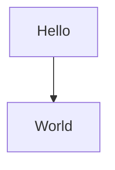

# SELF Documentation

This directory contains documentation for the SELF project, including:

- Architecture documentation
- Integration guides
- Technical specifications
- API documentation

## Documentation Tools

This documentation uses Mermaid for diagram generation. Mermaid diagrams are written in markdown and will render as interactive diagrams in GitHub.

To view the diagrams properly, ensure that:
1. You are viewing the documentation in GitHub
2. Your GitHub settings have Mermaid diagrams enabled

## Directory Structure

```
docs/

│   ├── README.md
│   └── NodeInitialization.md
└── architecture/
    └── README.md
```

## Mermaid Diagram Example



This example should render as a simple diagram in GitHub.
