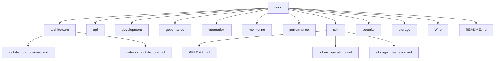

# SELF Documentation

## Overview

This documentation provides comprehensive technical documentation for the SELF blockchain project, covering all aspects from core architecture to implementation details. The documentation is organized into several key sections to facilitate easy navigation and understanding.

## Core Documentation Structure

### 1. Architecture Documentation
- [Architecture/](https://github.com/SELF-Technology/self-chain-public/tree/main/docs/Architecture)
  - [SELF_chain_architecture.md](https://github.com/SELF-Technology/self-chain-public/blob/main/docs/Architecture/SELF_chain_architecture.md): Comprehensive system architecture

### 2. Consensus
- [PoAI/](https://github.com/SELF-Technology/self-chain-public/tree/main/docs/PoAI)
  - [Taxonomy.md](https://github.com/SELF-Technology/self-chain-public/blob/main/docs/PoAI/Taxonomy.md): PoAI taxonomy and classification

### 3. API Documentation
- [API/](https://github.com/SELF-Technology/self-chain-public/tree/main/docs/API)
  - [API_DOCUMENTATION.md](https://github.com/SELF-Technology/self-chain-public/blob/main/docs/API/API_DOCUMENTATION.md): Comprehensive API reference

### 4. Development
- [Development/](https://github.com/SELF-Technology/self-chain-public/tree/main/docs/Development)
  - [Code_Style_Guide.md](https://github.com/SELF-Technology/self-chain-public/blob/main/docs/Development/Code_Style_Guide.md): Code style and conventions
  - [Testing_Requirements.md](https://github.com/SELF-Technology/self-chain-public/blob/main/docs/Development/Testing_Requirements.md): Testing framework and requirements
  - [SELFScript/SELFSCRIPT_SPEC.md](https://github.com/SELF-Technology/self-chain-public/blob/main/docs/SELFScript/SELFSCRIPT_SPEC.md): SelfScript specification
  - [SELFScript/SELFSCRIPT_DEVELOPER_GUIDE.md](https://github.com/SELF-Technology/self-chain-public/blob/main/docs/SELFScript/SELFSCRIPT_DEVELOPER_GUIDE.md): SelfScript developer guide

### 5. Governance
- [Governance/](https://github.com/SELF-Technology/self-chain-public/tree/main/docs/Governance)
  - [ai_training_system.md](https://github.com/SELF-Technology/self-chain-public/blob/main/docs/Governance/ai_training_system.md): AI governance documentation
  - [governance_implementation.md](https://github.com/SELF-Technology/self-chain-public/blob/main/docs/Governance/governance_implementation.md): Governance implementation details

### 6. Integration
- [Integration/](https://github.com/SELF-Technology/self-chain-public/tree/main/docs/Integration)
  - [Coinbase_Integration.md](https://github.com/SELF-Technology/self-chain-public/blob/main/docs/Integration/Coinbase_Integration.md): Coinbase integration details
  - [Rosetta_Erc20_Integration.md](https://github.com/SELF-Technology/self-chain-public/blob/main/docs/Integration/Rosetta_Erc20_Integration.md): Rosetta ERC20 integration
  - [Minima/backward_compatibility.md](https://github.com/SELF-Technology/self-chain-public/blob/main/docs/Integration/Minima/backward_compatibility.md): Minima backward compatibility
  - [Wire/Wire_Network_Integration.md](https://github.com/SELF-Technology/self-chain-public/blob/main/docs/Integration/Wire/Wire_Network_Integration.md): Wire Network integration

### 7. Monitoring
- [Monitoring/](https://github.com/SELF-Technology/self-chain-public/tree/main/docs/Monitoring)
  - [Monitoring_and_alerting.md](https://github.com/SELF-Technology/self-chain-public/blob/main/docs/Monitoring/Monitoring_and_alerting.md): Monitoring system documentation

### 8. Performance
- [Performance/](https://github.com/SELF-Technology/self-chain-public/tree/main/docs/Performance)
  - [Tps_Optimization.md](https://github.com/SELF-Technology/self-chain-public/blob/main/docs/Performance/Tps_Optimization.md): Transaction processing optimization
  - [Advanced_Tps_Optimization.md](https://github.com/SELF-Technology/self-chain-public/blob/main/docs/Performance/Advanced_Tps_Optimization.md): Advanced optimization techniques

### 9. SDK
- [SDK/](https://github.com/SELF-Technology/self-chain-public/tree/main/docs/SDK)
  - [README.md](https://github.com/SELF-Technology/self-chain-public/blob/main/docs/SDK/README.md): SDK overview and features
  - [Token_operations.md](https://github.com/SELF-Technology/self-chain-public/blob/main/docs/SDK/Token_operations.md): Token operations documentation
  - [Storage_integration.md](https://github.com/SELF-Technology/self-chain-public/blob/main/docs/SDK/Storage_integration.md): Storage integration documentation

### 10. Security
- [Security/](https://github.com/SELF-Technology/self-chain-public/tree/main/docs/Security)
  - [Ai_Capacity_Implementation.md](https://github.com/SELF-Technology/self-chain-public/blob/main/docs/Security/Ai_Capacity_Implementation.md): AI capacity implementation
  - [Overview.md](https://github.com/SELF-Technology/self-chain-public/blob/main/docs/Security/Overview.md): Security overview documentation

### 11. Storage
- [Storage/](https://github.com/SELF-Technology/self-chain-public/tree/main/docs/Storage)
  - [Hybrid_Architecture.md](https://github.com/SELF-Technology/self-chain-public/blob/main/docs/Storage/Hybrid_Architecture.md): Hybrid storage architecture (IPFS + OrbitDB)

## Key Technical Components

### 1. Core Architecture
- Proof-of-AI (PoAI) consensus mechanism
- Hybrid storage architecture (IPFS + OrbitDB)
- Cross-chain capabilities
- AI integration with Ollama Cloud
- Advanced sharding implementation
- Compute distribution system
- Resource optimization
- Load balancing

### 2. Storage Layer
- Decentralized storage using IPFS
- Real-time database with OrbitDB
- Cross-chain data synchronization
- Advanced sharding
- Storage optimization
- Data consistency

### 3. AI Integration
- Ollama Cloud integration
- Context management
- AI-powered validation
- Assistant functionality
- Validator reputation system
- AI-powered security validation

### 4. Security Features
- Decentralized key management
- Transaction signing and verification
- Network security
- AI-powered security validation
- Validator reputation system
- Context-aware security

### 5. SDK Layer
- Multi-language support (Rust, Java, JavaScript, Solidity)
- Token operations
- Storage integration
- AI capabilities
- Cross-chain functionality
- Key management
- Authentication
- Local development tools
- Testing utilities
- Integration examples

### 6. Grid Compute
- Advanced sharding implementation
- Compute distribution
- Resource optimization
- Load balancing
- Performance monitoring
- Resource allocation
- Fault tolerance

## Documentation Tools

This documentation uses several tools and technologies:

1. **Mermaid Diagrams**
   - Interactive diagram generation
   - GitHub rendering support
   - Architecture visualization
   - Real-time updates
   - Flowchart support

2. **Markdown**
   - Structured documentation
   - Easy maintenance
   - GitHub compatibility
   - Cross-referencing
   - Code highlighting

3. **Version Control**
   - Git integration
   - Documentation history
   - Branch management
   - Change tracking
   - Collaboration support

4. **Development Tools**
   - Local development environment
   - Testing utilities
   - Integration testing
   - Performance monitoring
   - Debugging tools

5. **Integration Tools**
   - Cross-chain integration
   - Storage integration
   - AI integration
   - Network tools
   - Monitoring tools

## Getting Started

### Prerequisites
- GitHub account
- Mermaid diagram viewer enabled
- Basic understanding of blockchain concepts

### Navigation Tips
1. Start with the architecture overview
2. Explore specific components in their respective folders
3. Use the SDK documentation for development
4. Reference the API documentation for integration

## Documentation Standards

1. **Consistency**
   - Standard markdown format
   - Clear section headers
   - Consistent terminology

2. **Accuracy**
   - Regular updates
   - Technical verification
   - Code examples

3. **Clarity**
   - Simple explanations
   - Step-by-step guides
   - Visual aids

## Contact

For questions, please email [j@self.app](mailto:j@self.app).

## Directory Structure

## SELF Chain Architecture

This diagram shows the complete architecture of the SELF Chain system, including all layers and their relationships.

This diagram shows the complete documentation structure, with each component linked to its respective subcomponents. The documentation is designed to be both comprehensive and modular, allowing developers to dive deep into specific areas while maintaining an overview of the entire system.

## Additional Resources

- PoAI Documentation: https://proofofai.com
- Ollama Cloud Documentation: https://ollama.ai/docs
- IPFS Integration Guide: https://docs.ipfs.tech/
- OrbitDB Documentation: https://orbitdb.org/docs/

## Contact

For questions or contributions, please email [j@self.app](mailto:j@self.app).

## Documentation References

- Ollama Cloud: https://ollama.ai/docs
- IPFS: https://docs.ipfs.tech/
- OrbitDB: https://orbitdb.org/docs/
