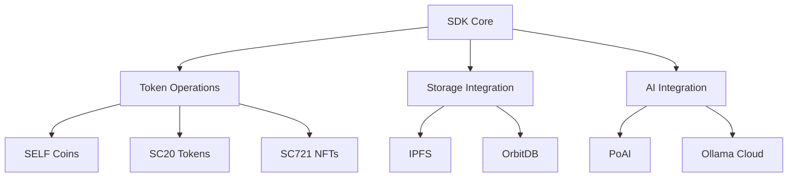

# SELF SDK Documentation

## Overview
The SELF SDK provides a comprehensive toolkit for interacting with the SELF blockchain and its various components. The SDK supports multiple programming languages and offers a unified interface for blockchain operations.

### Supported Languages
- Rust (primary implementation)
- Java (legacy support)
- JavaScript (web integration)
- Solidity (smart contract development)

### Key Features
- Blockchain operations
- Smart contract integration
- Storage integration
- AI capabilities
- Cross-chain functionality
- Key management
- Authentication
- Local development tools
- Testing utilities

## Key Components

### 1. Core SDK
- Multi-language support (Rust, Java, JavaScript)
- Token operations (SELF coins, SC20 tokens)
- Storage integration (IPFS, OrbitDB)
- AI capabilities (PoAI, Ollama Cloud)

### 2. Token Operations
- SELF coin management
- SC20 token creation and management
- NFT (SC721) support
- Token transfers and balances

### 3. Storage Integration
- IPFS file storage
- OrbitDB database access
- Cross-chain storage capabilities
- Decentralized file sharing

### 4. AI Integration
- PoAI validation
- Ollama Cloud integration
- AI-powered validation
- Context management
- Smart contract AI verification
- Cross-chain AI validation

## Implementation Details

### SDK Architecture

