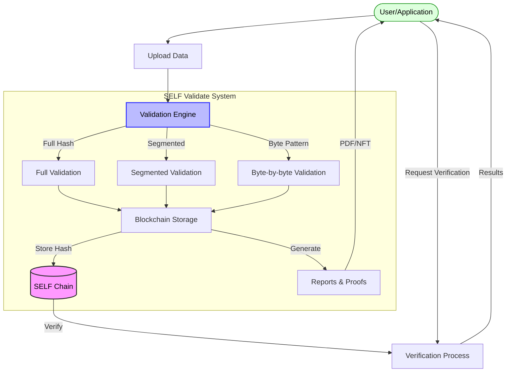

# SELF Validate

## Overview

SELF Validate is a comprehensive data validation and verification system built on SELF Chain. It provides tamper-evident proof of data integrity using blockchain technology, enabling users to validate, verify, and certify digital assets with cryptographic certainty.



## Key Features

### Data Integrity Verification
- Full file verification using SHA3-256 hashing
- Support for large files through segmented verification
- Pattern-based matching for partial validation

### Blockchain-Based Certification
- Immutable record of data validation on SELF Chain
- Timestamp anchoring for proof-of-existence
- Verifiable cryptographic proofs

### Multiple Verification Methods
- Full data hashing for complete file validation
- Configuration-driven segmented validation
- Byte-by-byte pattern matching for partial integrity checking
- Data-by-reference validation against on-chain records

### Enterprise-Ready Features
- API for seamless integration
- Report generation with PDF certificates
- Optional NFT-based validation certificates
- Audit trail capabilities

## Use Cases

### Document Certification
Validate the authenticity and integrity of important documents such as contracts, certificates, and legal papers.

### Digital Asset Verification
Ensure the integrity of digital assets including media files, software packages, and data exports.

### Supply Chain Validation
Validate documentation and data across complex supply chains to ensure authenticity at each stage.

### Compliance and Audit
Create immutable audit trails and proof of compliance for regulatory requirements.

### Intellectual Property Protection
Timestamp and validate creative works, research, and intellectual property to establish proof of creation.

## Getting Started

### Integration Options
1. **Direct API Integration**: Integrate with your applications using our REST API
2. **Command-Line Tools**: Use our CLI tools for file validation and verification
3. **Web Interface**: Access the web-based portal for manual validation operations

### Sample Integration

```rust
use self_chain::validate::{ValidationClient, ValidationOptions};

async fn validate_document(file_path: &str) -> Result<ValidationProof, ValidationError> {
    let client = ValidationClient::new("https://api.selfchain.org/validate");
    
    let options = ValidationOptions::new()
        .with_full_verification(true)
        .with_segment_size(1024)
        .with_report_generation(true);
        
    client.validate_file(file_path, options).await
}
```

## Pricing

A volume of API tokens per month will be allocated to various pricing tiers, suitable for any size development team or organization. Details to follow.

## Security

SELF Validate leverages the security properties of SELF Chain and provides additional layers of cryptographic verification. All validations are signed, timestamped, and immutably recorded on the blockchain for maximum security and trust.

## Roadmap

- **Q3 2025**: Initial release with core validation features
- **Q4 2025**: Enhanced reporting and enterprise integrations
- **Q1 2026**: Advanced verification methods and performance optimizations
- **Q2 2026**: Mobile SDKs and expanded client libraries
