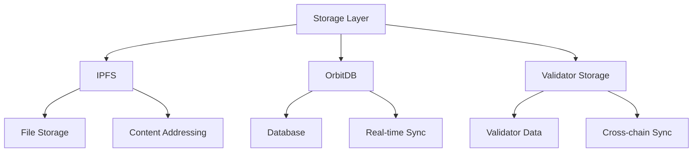

# Hybrid Storage Architecture

## Overview
The SELF Chain hybrid storage architecture combines multiple decentralized storage solutions to provide a robust and efficient storage system. This architecture leverages the strengths of each storage solution while mitigating their weaknesses.

## Core Components

### 1. IPFS Integration
- Content-addressable storage
- Decentralized file system
- Immutable data storage
- Permanent file storage
- Cross-chain file sharing

#### Validation Proof Storage
- Permanent storage of validation proofs
- Content-addressable validation records
- Cross-chain data storage
- Immutable validation history

#### Use Cases
- Store validator certificates
- Store validation proofs
- Store cross-chain validation data
- Store reputation history

### 2. OrbitDB Integration
- Decentralized database
- Real-time synchronization
- Event logging
- Version control
- Validator data storage

### 3. Storage Layer Integration

## Data Flow

### 1. File Storage
1. Files are uploaded to IPFS
2. Content is addressed via CID
3. Metadata is stored in OrbitDB
4. Cross-chain references are maintained

### 2. Validator Data
1. Validator profiles in OrbitDB
2. Validation proofs in IPFS
3. Reputation scores in OrbitDB
4. Cross-chain validation tracking

## Key Features

### 1. Redundancy
- Multiple storage layers
- Data replication
- Cross-chain backup
- Version control

### 2. Performance
- Content caching
- Load balancing
- Network optimization
- Bandwidth management

### 3. Security
- Data encryption
- Access control
- Integrity verification
- Permission management

## Implementation Details

### 1. Storage Optimization
- Content deduplication
- Bandwidth optimization
- Cache management
- Resource allocation

### 2. Cross-chain Integration
- Chain-agnostic storage
- Data synchronization
- Cross-chain validation
- Network overlay

### 3. Security Measures
- Data encryption
- Access control
- Audit logging
- Permission management

## Best Practices

### 1. Data Management
- Proper content addressing
- Regular backups
- Version control
- Data validation

### 2. Performance
- Content caching
- Network optimization
- Load balancing
- Resource monitoring

### 3. Security
- Data encryption
- Access control
- Regular audits
- Security monitoring
