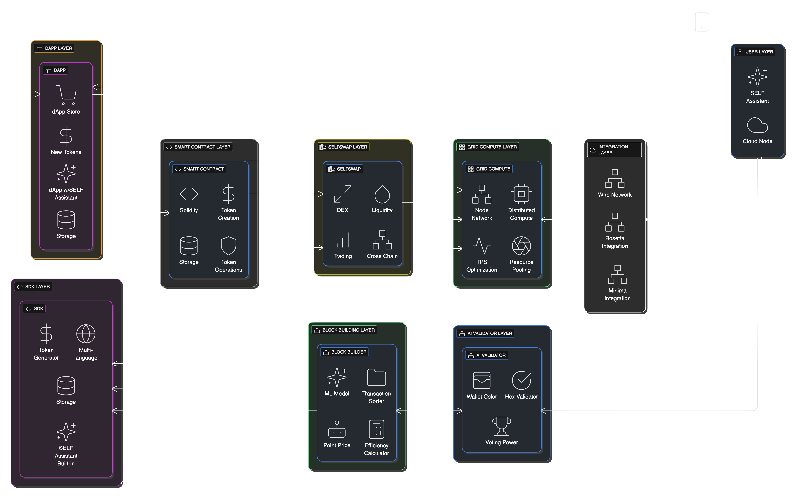

# SELF Chain Public Architecture

## 🏗️ Architecture Components

SELF Chain implements a revolutionary architecture combining AI and blockchain:

- **Blockchain Core** - Advanced blockchain implementation
  - Block structure with AI-enhanced validation
  - Chain management with Proof of AI consensus
  - High-performance transaction processing
  
- **Consensus (PoAI)** - World's first Proof of AI mechanism
  - AI-powered validator selection
  - Reputation-based voting system
  - Energy-efficient consensus
  
- **Networking** - Enterprise-grade communication layer
  - Secure P2P protocols
  - TLS encryption throughout
  - Cloud-optimized architecture
  
- **Storage** - Hybrid distributed storage system
  - IPFS for decentralized content
  - OrbitDB for real-time data
  - Privacy-preserving storage layers
  
- **Cryptography** - Post-quantum security
  - Kyber key encapsulation
  - SPHINCS+ signatures
  - Hybrid cryptographic approach
  
- **AI Integration** - Native AI validation system
  - Pattern analysis for security
  - Context management for transactions
  - Intelligent validation services

### 👨‍💻 Developer Resources

Build on SELF Chain using our comprehensive SDKs:

- **[Developer Guide Overview](/building-on-self)** - Start here to understand SELF's capabilities
  - AI-native blockchain platform overview
  - What you can build with SELF
  - Current development status
  
- **[SDK Preparation Guide](/building-on-self/getting-started)** - Prepare for SDK development
  - SDK installation and configuration (coming Q4 2025)
  - Design principles and architecture
  - Getting ready for development
  
- **[MCP Integration](/building-on-self/mcp-integration)** - AI-native development concepts
  - Model Context Protocol for blockchain
  - Privacy-preserving AI collaboration
  - Cross-application intelligence

---

## SELF Ecosystem Overview

### SaaS Platform Model

SELF Chain operates as a managed service platform:

1. **User Node Provisioning**
   - Automatic node deployment when users create a SELF account
   - Free trial period with managed infrastructure
   - Subscription-based model after trial period
   - Seamless transition between free and paid tiers

2. **AI Model Integration**
   - Default AI model provided with each user account
   - User-configurable AI preferences stored persistently
   - Model upgrade options for subscription users
   - Custom AI training with user preferences

3. **Super-App Integration**
   - Blockchain nodes integrated with SELF Super-App
   - Cross-app communication protocols
   - Persistent user data synchronization
   - Unified authentication and authorization

### B2B Constellation Architecture

SELF provides enterprise-grade blockchain solutions:

1. **Corporate Layer-1 Chains**
   - Managed provisioning of parallel Layer-1 blockchains
   - Similar to Polkadot parachains but for full Layer-1 chains
   - Configurable AI model deployment for enterprise nodes
   - Custom token generation capabilities

2. **Enterprise Management**
   - SaaS management of corporate blockchain infrastructure
   - Monitoring and health dashboards for enterprise clients
   - Resource allocation and scaling for business needs
   - Enterprise billing and subscription management

3. **Ecosystem Interoperability**
   - Inter-chain communication between SELF and corporate chains
   - Shared security and validation model
   - Cross-chain transactions and data sharing
   - Unified analytics and monitoring

## 1. Core Architecture

### 1.1 Cloud-First Architecture

SELF Chain operates exclusively in a cloud-first environment:

1. **Cloud Processing**
   - All operations occur in the cloud
   - Distributed cloud nodes
   - Secure cloud storage
   - Cloud-optimized processing

2. **Cloud Infrastructure**
   - Fully distributed cloud nodes
   - Secure cloud storage
   - Encrypted cloud communication
   - Cloud-optimized infrastructure

3. **Remote Access**
   - Cloud-only interaction model
   - Secure cloud APIs
   - Remote-first user experience

### 1.2 Network Architecture

#### 1.2.1 Peer Discovery
- Periodic peer discovery from bootstrap nodes
- Peer-to-peer discovery through known peers
- Peer stats tracking and reliability scoring
- Network topology metrics

#### 1.2.2 Message Routing
- Gossipsub for message propagation
- Kademlia for peer discovery
- Routing table with peer statistics
- Message forwarding with TTL
- Flood threshold protection

#### 1.2.3 Connection Management
- Connection pooling per peer
- Connection timeout handling
- Active connection tracking
- Error handling and recovery

### 1.3 Storage Architecture

#### 1.3.1 Hybrid Storage
- Decentralized storage using IPFS
- Real-time database with OrbitDB
- Cross-chain data synchronization
- Secure data integrity

#### 1.3.2 Storage Features
- Distributed data storage
- Data versioning
- Data integrity verification
- Secure access control

## 2. Security Architecture

### 2.1 Network Security

1. **Connection Security**
   - TLS encryption for all peer connections
   - Message signing and verification
   - Peer authentication
   - Network message validation

2. **Data Security**
   - End-to-end encryption
   - Message integrity verification
   - Secure data storage
   - Access control

### 2.2 AI Security

1. **AI Validation**
   - OpenLLM integration
   - Context-aware validation
   - Validator reputation system
   - Secure AI processing

2. **Security Features**
   - Secure cloud APIs
   - Encrypted cloud channels
   - Cloud node authentication
   - Distributed cloud security

## 3. Performance Optimization

### 3.1 Network Optimization

#### 3.1.1 Connection Pooling
- Limits concurrent connections per peer
- Prevents resource exhaustion
- Optimizes network bandwidth usage
- Reduces connection overhead

#### 3.1.2 Routing Optimization
- Intelligent peer selection
- Path optimization
- Load balancing
- Error recovery

### 3.2 Storage Optimization
- Optimized data synchronization
- Efficient data retrieval
- Resource utilization
- Performance monitoring

## 4. Monitoring and Metrics

### 4.1 Network Metrics
- Peer connection statistics
- Message latency
- Network throughput
- Error rates
- Peer reliability scores

### 4.2 Performance Metrics
- Connection pool utilization
- Message delivery success rates
- Network congestion levels
- Resource usage
- Storage performance

## 5. Future Enhancements

### 5.1 Network Improvements
- Advanced peer selection algorithms
- Dynamic routing optimization
- Enhanced security features
- Improved error recovery
- Advanced monitoring capabilities

### 5.2 Storage Improvements
- Enhanced data synchronization
- Improved data integrity
- Optimized storage performance
- Advanced access control

### 5.3 Security Enhancements
- Enhanced cloud security
- Improved encryption
- Better access controls
- Advanced monitoring

## 6. Documentation References

- OpenLLM: https://github.com/bentoml/OpenLLM
- IPFS: https://docs.ipfs.tech/
- OrbitDB: https://github.com/orbitdb
- Network Protocols: https://docs.ipfs.tech/
