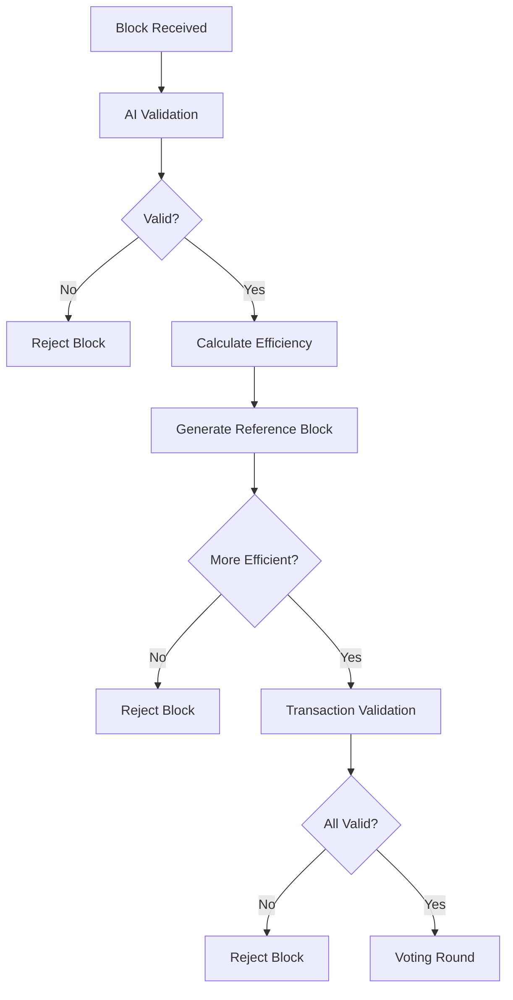
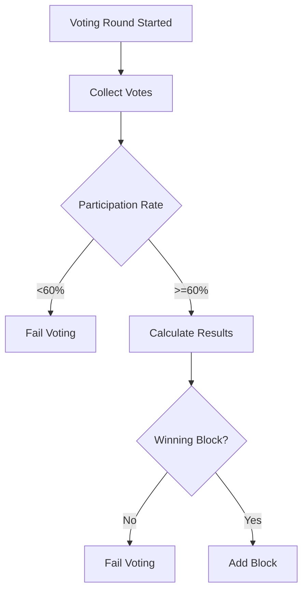

# PoAI Consensus Mechanism

The Proof of AI (PoAI) consensus mechanism is a novel blockchain consensus algorithm that leverages artificial intelligence for block validation and selection. This implementation follows the principles outlined in the PoAI whitepaper (https://proofofai.com).

## Core Components

### 1. AI Validator
The AIValidator component is responsible for:
- Block efficiency calculation
- Transaction validation with color markers
- Reference block generation
- Wallet color management

#### Block Efficiency Calculation
Blocks are evaluated based on:
- Transaction complexity
- Data value
- AI validation score
- Color marker transitions

#### Color Marker System
Each transaction is assigned a color marker based on:
- Transaction hash
- Wallet history
- AI validation score
- Time-based transitions

### 2. Voting System
The VotingSystem implements a decentralized voting mechanism for block selection:
- Validator eligibility checks
- Voting rounds
- Participation rate calculation
- Block selection based on voting results

#### Voting Process
1. Block proposer initiates voting round
2. Eligible validators cast votes
3. Votes are validated and counted
4. Block is selected based on majority vote
5. Results are broadcast to network

### 3. Error Handling
The consensus mechanism includes comprehensive error handling with specific error types:

#### Error Types
- BlockValidationFailed: Block failed validation checks
- VotingError: Issues during voting process
- AIValidationError: AI service validation failures
- InsufficientParticipation: Voting participation requirements not met
- LowBlockEfficiency: Block efficiency below threshold
- InvalidColorTransition: Invalid color marker transitions
- ValidatorNotEligible: Validator not eligible to vote
- NoVotingResult: No voting results available
- StorageError: Storage-related failures
- NetworkError: Network communication failures
- SerializationError: Data serialization issues

## Implementation Details

### Block Validation Flow

### Voting Process Flow

## Integration Points

### Blockchain Integration
The consensus mechanism integrates with the blockchain through:
- Block validation
- Transaction processing
- Storage operations
- Network communication

### Network Integration
The voting system uses network messages for:
- Voting round initiation
- Vote casting
- Result broadcasting
- Peer synchronization

## Error Handling Strategy

### Error Categories
1. **Validation Errors**
   - Block validation failures
   - Transaction validation failures
   - Color marker validation

2. **Voting Errors**
   - Participation rate issues
   - Voting process failures
   - Network communication errors

3. **System Errors**
   - Storage failures
   - Network failures
   - Serialization issues

### Error Recovery
- Validation failures: Block is rejected
- Voting failures: Voting round is restarted
- Network failures: Operation is retried
- Storage failures: Operation is logged and retried

## Monitoring Metrics

### Key Metrics
1. **Validation Metrics**
   - Block validation success rate
   - Transaction validation rate
   - Color marker transitions
   - AI validation scores

2. **Voting Metrics**
   - Voting participation rate
   - Voting round duration
   - Block selection success rate
   - Validator activity

3. **System Metrics**
   - Network latency
   - Storage operations
   - Error rates
   - Performance metrics

## Security Considerations

### Validation Security
- AI validation scores are normalized
- Color markers prevent manipulation
- Block efficiency is calculated independently
- Voting results are verified

### Voting Security
- Validator eligibility checks
- Participation rate enforcement
- Voting result verification
- Network message validation

### Network Security
- Message authentication
- Peer validation
- Network partition handling
- Sybil attack prevention

## Future Improvements

1. **Enhanced Validation**
   - More sophisticated AI validation models
   - Advanced color marker algorithms
   - Better block efficiency metrics

2. **Improved Voting**
   - Weighted voting system
   - Dynamic participation thresholds
   - Better validator selection

3. **Enhanced Security**
   - Advanced encryption
   - Better peer validation
   - Improved error handling

4. **Performance Optimizations**
   - Faster validation
   - Optimized voting process
   - Better network communication

## References
- PoAI Whitepaper: https://proofofai.com
- AI Validation Documentation
- Voting System Documentation
- Error Handling Documentation
