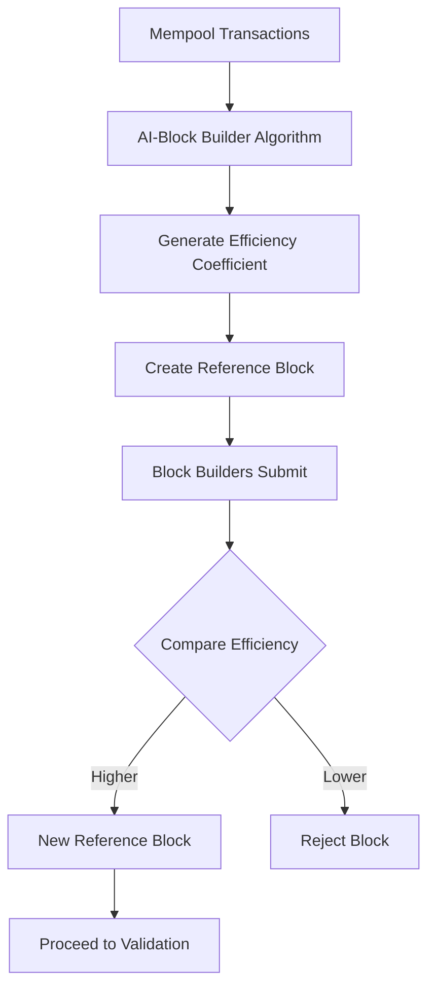
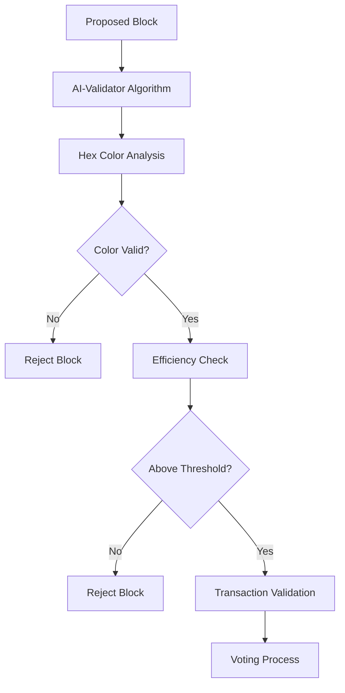
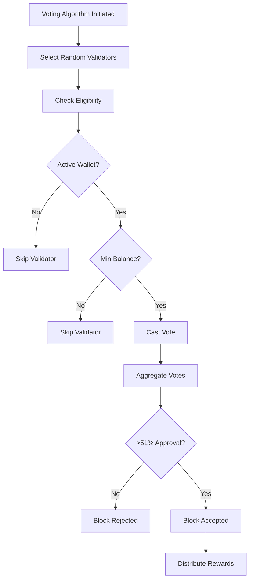

# PoAI Consensus Mechanism

The Proof-of-AI (PoAI) consensus mechanism is a novel, patent-pending blockchain consensus algorithm that leverages artificial intelligence to achieve decentralized validation through efficiency optimization. This implementation follows the principles outlined at https://proofofai.com.

## Overview

PoAI drives efficiency by removing human interference and focusing on objective task fulfillment. Unlike Proof-of-Work (inefficient due to computational waste) and Proof-of-Stake (increasingly centralized), PoAI uses AI algorithms to maximize network efficiency.

## Core Algorithms

### 1. AI-Block Builder Algorithm
Forms efficient blocks of transactions and generates efficiency coefficients:
- Reviews transactions from mempool
- Optimizes for maximum Points volume
- Maintains PointPrice stability
- Creates blocks with highest efficiency (Input minus Output)

### 2. Voting Algorithm
Orchestrates voting between AI algorithms to achieve consensus:
- Manages validator selection
- Coordinates voting rounds
- Ensures fair participation
- Distributes rewards according to protocol

### 3. AI-Validator Algorithm
Validates blocks and determines block entry permissions:
- Performs hex color validation
- Verifies efficiency metrics
- Checks color marker transitions
- Confirms block integrity

## Key Components

### HEX Wallet System
Every wallet contains a unique color attribute as a hexadecimal value:
- Colors serve as primary identifiers for AI validators
- Transaction signing generates hexadecimal hashes
- Colors change dynamically with transaction processing

### HEX Transaction Processing
Transaction hashes are divided into six parts to create a single hexadecimal number:
- Enables pattern recognition by AI validators
- Facilitates color-based validation
- Ensures transaction authenticity

### Color Markers
Dynamic visual identifiers for blockchain validation:
- Used to connect blocks to the blockchain
- Change based on transaction patterns
- Primary mechanism for ensuring integrity

### Reference Block
The optimal block generated by PoAI mechanism:
- Serves as comparison standard
- All builder blocks evaluated against it
- Most efficient block wins

### Efficiency Coefficient
Numeric measurement of block quality:
- Calculated as percentage of useful data (Input minus Output)
- Determines block builder selection
- Core metric for all decisions

## Consensus Process

### Block Building Flow

### Validation Flow

### Voting Process

## Validator Requirements

### Eligibility Criteria
- **Active Wallet**: Transactions within last N hours
- **Minimum Balance**: Hold minimum SELF Coins/Points
- **Network Participation**: Online and responsive
- **Random Selection**: Accept randomized selection

### Validator Types
1. **Lite Nodes**: Store wallet addresses and color markers
2. **AI Validators**: Run validation algorithms
3. **Block Builders**: Create efficient blocks

## Reward Distribution

Rewards are distributed to maintain network security and incentivize efficiency:
- **Block Builder**: 90% for successful block creation
- **AI Validators (Voters)**: 8% distributed among correct voters
- **AI Validator (Color Checker)**: 1% for color scheme verification
- **PoAI Reserve Fund**: 1% for system maintenance

## Efficiency Metrics

### Points Volume Maximization
- Blocks optimized for maximum Points (native token) volume
- Ensures efficient block space usage
- Maximizes network throughput

### PointPrice Stability
- AI algorithms maintain stable pricing across blocks
- Prevents dramatic fluctuations
- Ensures predictable transaction costs

## Implementation Details

### Error Types
- `BlockValidationFailed`: Block failed validation checks
- `VotingError`: Issues during voting process
- `AIValidationError`: AI service validation failures
- `InsufficientParticipation`: < 33% participation
- `LowBlockEfficiency`: Efficiency below threshold
- `InvalidColorTransition`: Invalid hex color progression
- `ValidatorNotEligible`: Doesn't meet requirements
- `NoVotingResult`: No consensus reached
- `StorageError`: Storage-related failures
- `NetworkError`: Communication failures
- `SerializationError`: Data serialization issues

### Timeout Mechanism
Successful block builders enter cooldown period:
- N-block timeout after winning
- Ensures fair opportunity distribution
- Prevents validator monopolization

## Security Considerations

### Validation Security
- Hex signature verification
- Color transition validation
- Efficiency threshold enforcement
- Independent calculation verification

### Voting Security
- Cryptographic vote proofs
- Stake-weighted influence caps
- Sybil attack prevention
- Double-vote prevention

### Network Security
- Message authentication
- Peer validation
- Partition handling
- Eclipse attack mitigation

## Monitoring Metrics

### Key Performance Indicators
- Block efficiency scores
- Voting participation rates
- Color transition accuracy
- Network throughput
- PointPrice stability

### Alert Thresholds
- Low participation (below 20%)
- Efficiency degradation
- Unusual voting patterns
- Failed validations

## Governance Integration

The consensus mechanism integrates with governance through:
- Proposal efficiency evaluation
- Validator participation in governance
- Network parameter adjustments
- Protocol upgrades

## Future Enhancements

1. **Advanced Efficiency Metrics**
   - Multi-dimensional scoring
   - Predictive optimization
   - Cross-chain efficiency comparison

2. **Enhanced Color Algorithms**
   - More complex transition patterns
   - Advanced pattern recognition
   - Quantum-resistant color schemes

3. **Improved Validator Selection**
   - Geographic distribution
   - Performance-based weighting
   - Reputation integration

4. **Scalability Improvements**
   - Parallel validation
   - Sharded voting
   - Optimized communication

## References
- PoAI Whitepaper: https://proofofai.com
- SELF Chain Technical Documentation
- Governance Implementation Guide
- PoAI Taxonomy Documentation