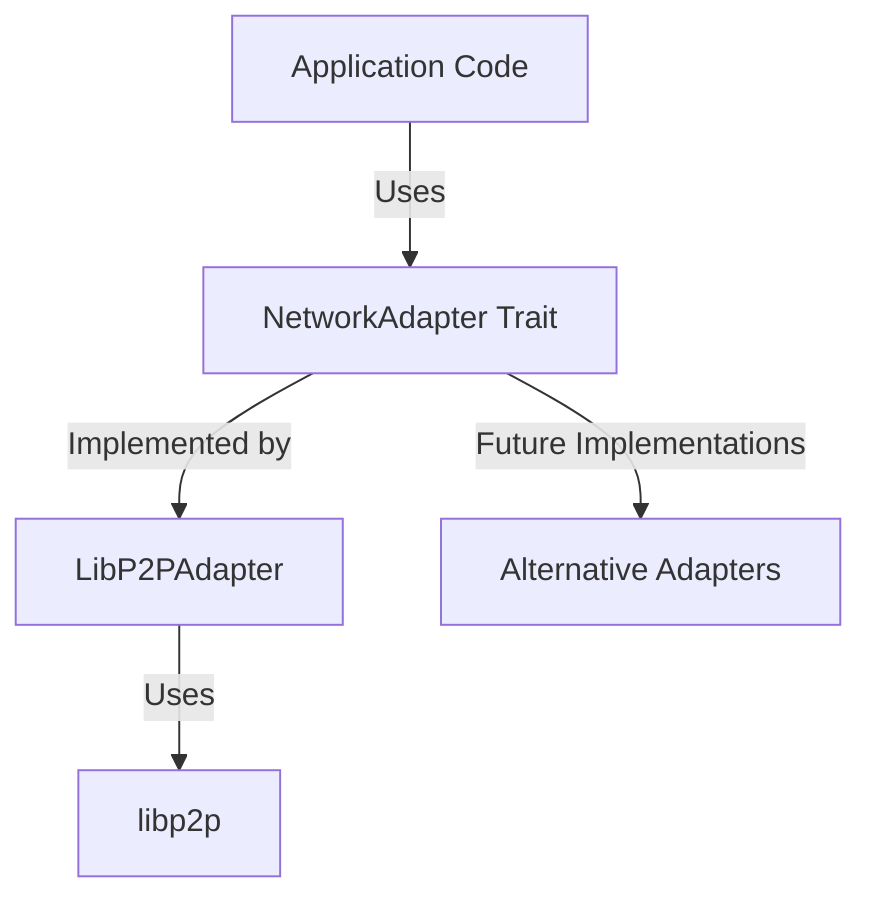

# Network Abstraction Layer

## Purpose

This module provides an abstraction layer over the peer-to-peer networking implementation, allowing the application to interact with the network without being tightly coupled to the underlying transport library (currently libp2p). 

## Security Rationale

This abstraction was created specifically to address security vulnerabilities in transitive dependencies:

1. **RUSTSEC-2025-0009**: `ring` 0.16.20 - AES functions may panic when overflow checking is enabled
2. **RUSTSEC-2025-0010**: `ring` 0.16.20 - Unmaintained
3. **RUSTSEC-2024-0436**: `paste` 1.0.15 - Unmaintained (used by libp2p's network stack)

These dependencies are used by libp2p, and updating libp2p to a newer version would require significant API changes throughout the codebase. By isolating the p2p implementation details behind this abstraction layer, we:

1. Contain the impact of libp2p API changes to a smaller part of the codebase
2. Make future security updates easier to implement
3. Enable the possibility of switching to different networking implementations if needed

## Architecture

The abstraction layer consists of the following components:

- **NetworkAdapter trait**: The main interface that defines network operations
- **LibP2PAdapter**: Current implementation using libp2p
- **Common types**: Message types, peer information, and errors



## Usage

Instead of using libp2p directly, application code should:

1. Create a network adapter using the factory function:
   ```rust
   let config = NetworkConfig { /* ... */ };
   let network = create_network_adapter(config);
   ```

2. Interact with the network through the adapter interface:
   ```rust
   // Connect to a peer
   network.connect_to_peer("peer_id", "address").await?;
   
   // Send a message
   let payload = MessagePayload::new(MessageType::Block, data);
   network.send_message("peer_id", payload).await?;
   
   // Register a message handler
   network.register_message_handler(|peer, message| {
       // Handle incoming messages
       Ok(())
   }).await?;
   ```

## Migration Plan

This abstraction layer is the first step in a planned migration to address security vulnerabilities:

1. **Phase 1** (Completed): Introduce abstraction layer
2. **Phase 2**: Update libp2p implementation to use latest versions (requires changes only to LibP2PAdapter)
3. **Phase 3**: Evaluate alternative P2P libraries and potentially create additional adapter implementations

## Adapter Interface

The `NetworkAdapter` trait defines the following operations:

- **initialize()**: Set up the network adapter
- **start()**: Begin listening for connections
- **stop()**: Shut down the network
- **connect_to_peer()**: Connect to a specific peer
- **disconnect_peer()**: Disconnect from a peer
- **broadcast_message()**: Send a message to all peers
- **send_message()**: Send a message to a specific peer
- **get_connected_peers()**: List all connected peers
- **is_peer_connected()**: Check if a peer is connected
- **get_network_stats()**: Get network statistics
- **register_message_handler()**: Set up a callback for incoming messages

## Implementation Notes

The current implementation wraps libp2p and includes:

- **Gossipsub** for broadcast messaging
- **Request/Response protocol** for direct peer communication
- **MDNS** for local network peer discovery
- **Noise protocol** for encrypted transport
- **Error translation** from libp2p-specific errors to application-agnostic NetworkError types